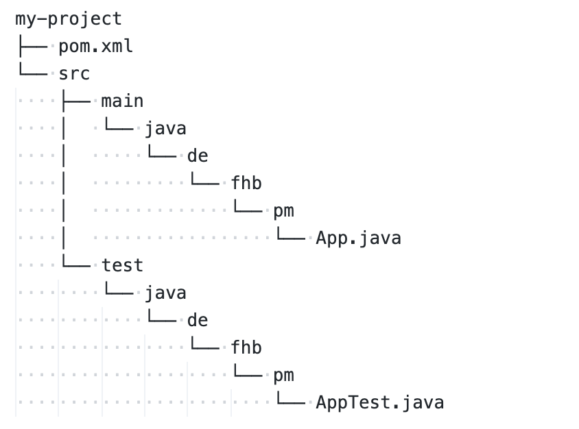
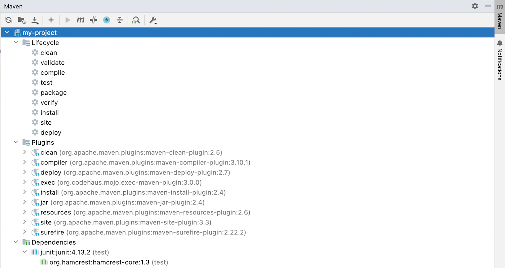

# Build-Systeme: Apache Maven

> [!IMPORTANT]
>
> <details open>
>
> <summary><strong>🎯 TL;DR</strong></summary>
>
> Zum Automatisieren von Arbeitsabläufen (Kompilieren, Testen, …) stehen
> in der Java-Welt verschiedene Tools zur Verfügung: Apache Ant, Apache
> Maven und Gradle sind sicher die am bekanntesten darunter.
>
> In Apache Maven ist bereits der typische Java-Standard-Lebenszyklus
> eingebaut und es müssen nur noch Abweichungen davon und Festlegung von
> Versionen und Dependencies in XML formuliert werden. Dies nennt man
> auch “*Convention over Configuration*”.
>
> Die Maven-Goals sind auswählbare Ziele und werden durch Plugins
> bereitgestellt. Zwischen den Goals sind Abhängigkeiten möglich (und
> bereits eingebaut). Über Properties kann man noch Namen und
> Versionsnummern o.ä. definieren.
>
> Abhängigkeiten zu externen Bibliotheken werden als Dependencies
> formuliert: Am besten den Abschnitt von Maven-Central kopieren.
> </details>

> [!TIP]
>
> <details open>
>
> <summary><strong>🎦 Videos</strong></summary>
>
> - [VL Apache Maven](https://youtu.be/YAW-_Wi4LDY)
> - [Demo Maven-Projekt](https://youtu.be/8z0UqtzISCA)
>
> </details>

## Build-Tool Maven: Alternative zu Ant oder Gradle

``` maven
mvn archetype:generate -DgroupId=de.hsbi.pm -DartifactId=my-project
                       -DarchetypeArtifactId=maven-archetype-quickstart
```

<picture><source media="(prefers-color-scheme: light)" srcset="images/screenshot_maven-project_light.png"><source media="(prefers-color-scheme: dark)" srcset="images/screenshot_maven-project_dark.png"></picture>

Von der zeitlichen Entstehung her kommt Maven nach Ant, aber vor Gradle.
Wie in Ant sind auch die Maven-Buildskripte XML-basierte Textdateien
(Gradle nutzt eine Groovy-basierte DSL).

Allerdings hat Maven im Gegensatz zu Ant bereits ein Modell des
Java-Entwicklungsprozess “eingebaut”: Im Ant-Skript muss alles, was man
tun möchte, explizit als Target formuliert werden, d.h. auch ein
Kompilieren der Sourcen oder Ausführen der Tests muss extra als Target
ins Ant-Skript geschrieben werden, um benutzbar zu sein. In Maven ist
dieses Modell bereits implementiert, d.h. hier muss man lediglich
zusätzliche oder abweichende Dinge im XML-File konfigurieren. Das nennt
man auch [“*convention over
configuration*”](https://en.wikipedia.org/wiki/Convention_over_configuration).

Der Maven-Aufruf
`mvn archetype:generate -DgroupId=de.hsbi.pm -DartifactId=my-project -DarchetypeArtifactId=maven-archetype-quickstart`
erzeugt mit Hilfe des Plugins `archetype`, welches das Ziel (engl.:
“*Maven goal*”) `generate` bereitstellt, ein neues Projekt mit dem Namen
`my-project` und der initialen Package-Struktur `de.hsbi.pm`. Das von
Maven für die Projekterstellung genutzte Plugin ist unter der ID
`maven-archetype-quickstart` in den Maven-Repositories (etwa
[Maven-Central](https://mvnrepository.com/repos/central)) verfügbar,
hier kann man mit der zusätzlichen Option `-DarchetypeVersion=1.4` auf
die letzte Version schalten.

Die erzeugte Ordnerstruktur entspricht der Standardstruktur von Gradle
(Gradle hat diese quasi von Maven übernommen). Die Konfigurationsdatei
für Maven hat den Namen `pom.xml`.

*Hinweis*: Die `groupId` und `artifactId` werden auch für eine
Veröffentlichung des Jar-Files des Projekts auf dem zentralen
Maven-Repository
[Maven-Central](https://mvnrepository.com/repos/central) genutzt. Von
hier würde Maven auch als Abhängigkeit konfigurierte Bibliotheken
herunterladen.

## Lebenszyklus (eingebaut in Maven)

<picture><source media="(prefers-color-scheme: light)" srcset="images/screenshot_maven-lifecycle_light.png"><source media="(prefers-color-scheme: dark)" srcset="images/screenshot_maven-lifecycle_dark.png"></picture>

In Maven ist das typische Java-Entwicklungsmodell als “Lebenszyklus”
implementiert.

Entsprechende Plugins stellen die jeweiligen “*Goals*” (Ziele) bereit.
Dabei sind auch die Abhängigkeiten berücksichtigt, d.h. das Ziel `test`
erfordert ein `compile` …

## Project Object Model: *pom.xml*

``` xml
<project>
    <!-- aktuelle Version für Maven 2.x-->
    <modelVersion>4.0.0</modelVersion>

    <!-- Basisinformationen -->
    <groupId>de.hsbi.pm</groupId>
    <artifactId>my-project</artifactId>
    <version>1.0-SNAPSHOT</version>

    <!-- Eigenschaften, vergleichbar zu den Properties in Ant -->
    <properties>
        <project.build.sourceEncoding>UTF-8</project.build.sourceEncoding>
        <maven.compiler.release>17</maven.compiler.release>
    </properties>

    <!-- Abhängigkeiten zu externen Bibliotheken -->
    <dependencies>
        <dependency>
            <groupId>junit</groupId>
            <artifactId>junit</artifactId>
            <version>4.13.2</version>
            <scope>test</scope>
        </dependency>
    </dependencies>
</project>
```

Die Konfigurationsdatei `pom.xml` stellt die Konfiguration für das
Maven-Projekt bereit (“Project Object Model”).

Es werden mindestens der Name des Projekts sowie die Abhängigkeiten
definiert.

Die `groupId` ist ein eindeutiger Bezeichner für die Organisation oder
den Autor des Projekts. Oft wird hier einfach wie im obigen Beispiel
eine Package-Struktur genutzt, aber wie im Fall von JUnit kann dies auch
ein einfacher String (dort “`junit`”) sein.

Die `artifactId` ist der eindeutige Name für das Projekt, d.h. unter
diesem Namen wird das generierte Jar-File im Maven-Repository zu finden
sein (sofern es denn veröffentlicht wird).

Über `dependencies` kann man benötigte Abhängigkeiten definieren, hier
als Beispiel JUnit in der 4.x Variante … Diese werden bei Bedarf von
Maven vom Maven-Repository heruntergeladen. Die Einträge für die
Dependencies findet man ebenfalls auf
[MavenCentral](https://mvnrepository.com/repos/central).

## Project Object Model: Plugins

``` xml
<project>
    ...

    <!-- Plugins: Stellen eigene "Goals" zur Verfügung -->
    <build>
        <plugins>
            <plugin>
                <!-- https://mvnrepository.com/artifact/org.apache.maven.plugins/maven-compiler-plugin -->
                <groupId>org.apache.maven.plugins</groupId>
                <artifactId>maven-compiler-plugin</artifactId>
                <version>3.10.1</version>
            </plugin>

            <plugin>
                <!-- https://mvnrepository.com/artifact/org.apache.maven.plugins/maven-surefire-plugin -->
                <groupId>org.apache.maven.plugins</groupId>
                <artifactId>maven-surefire-plugin</artifactId>
                <version>2.22.2</version>
            </plugin>
        </plugins>
    </build>
</project>
```

Zusätzlich können die Phasen des Build-Prozesses konfiguriert werden,
d.h. für die entsprechenden Plugins finden sich Abschnitte unter
`<build><plugins>` in der `pom.xml`.

Auf
[maven.apache.org/plugins/index.html](https://maven.apache.org/plugins/index.html)
finden Sie eine Übersicht über häufig benutzte Plugins sowie die von den
Plugins bereitgestellten Goals sowie Konfigurationsmöglichkeiten.

Die entsprechenden POM-Einträge finden Sie analog zu den Dependencies
ebenfalls auf [MavenCentral](https://mvnrepository.com/repos/central)
(Tag “plugin” statt “dependency”).

Plugins können aber auch selbst erstellt werden und in das Projekt
eingebunden werden, ein erster Einstieg ist die
[Plugin-API](https://maven.apache.org/ref/3.8.1/maven-plugin-api/).

## Und wie lasse ich jetzt eine Anwendung mal laufen?

- `mvn clean`: Lösche alle generierten Artefakte, beispielsweise
  `.class`-Dateien.
- `mvn compile` =\> `mvn compiler:compile`: Übersetze die Sourcen und
  schiebe die generierten `.class`-Dateien in den Ordner
  `target/classes/` (Default). Dazu werden alle Abhängigkeiten aufgelöst
  und bei Bedarf (neu) heruntergeladen (Default: Userverzeichnis, Ordner
  `.m2/`).
- `mvn test` =\> `mvn surefire:test`: Lasse die Tests laufen. Hängt von
  `compile` ab. Namenskonvention: Alle Klassen mit `*Test.java` und
  `Test*.java` im Standard-Testordner `src/test/java/` werden betrachtet
  (und weitere, vgl.
  [maven.apache.org/surefire/maven-surefire-plugin/examples/junit-platform.html](https://maven.apache.org/surefire/maven-surefire-plugin/examples/junit-platform.html)).
- `mvn package`: Hängt von `compile` ab und erzeugt ein Jar-File mit dem
  Namen “artifactId-version.jar” im Ordner `target/`. Mit `mvn install`
  kann man dieses Jar-File dann auch dem lokalen Repository im
  Home-Verzeichnis des Users (`.m2/`) hinzufügen.
- `mvn exec:java -Dexec.mainClass="de.hsbi.pm.Main"`: Hängt von
  `compile` ab und führt die Klasse `de.hsbi.pm.Main` aus.

<p align="right"><a href="https://github.com/Programmiermethoden-CampusMinden/PM-Lecture/blob/master/markdown/building/src/maven/pom.xml">Demo: pom.xml</a></p>

## Wrap-Up

Apache Maven: [maven.apache.org](https://maven.apache.org), [Maven
Getting Started
Guide](https://maven.apache.org/guides/getting-started/index.html)

- Automatisieren von Arbeitabläufen
- Apache Maven: Goals, Properties, Dependencies =\> “*Convention over
  Configuration*”, Java-Standard-Lebenszyklus eingebaut
  - Goals sind auswählbare Ziele, bereitgestellt durch Plugins
  - Abhängigkeiten zwischen Goals möglich
  - Properties agieren wie Variablen, etwa für Versionsnummern
  - Abhängigkeiten zu externen Bibliotheken werden als Dependencies
    formuliert: Abschnitt von Maven-Central kopieren

## 📖 Zum Nachlesen

- Ullenboom ([2021](#ref-Ullenboom2021))
- Inden ([2013](#ref-Inden2013))

> [!NOTE]
>
> <details>
>
> <summary><strong>✅ Lernziele</strong></summary>
>
> - k3: Schreiben einfacher Maven-Skripte zu Übersetzen des Projekts,
>   zum Testen und zum Erzeugen von Jar-Files
> - k3: Nutzung von Maven-Properties
> - k3: Einbinden externer Bibliotheken als Dependencies
> - k3: Ausführen von Maven-Goals aus IDE heraus und Einbindung als
>   Builder
>
> </details>

> [!TIP]
>
> <details>
>
> <summary><strong>🧩 Quizzes</strong></summary>
>
> - [Quiz Apache Maven
>   (ILIAS)](https://www.hsbi.de/elearning/goto.php?target=tst_1106215&client_id=FH-Bielefeld)
>
> </details>

------------------------------------------------------------------------

> [!NOTE]
>
> <details>
>
> <summary><strong>👀 Quellen</strong></summary>
>
> <div id="refs" class="references csl-bib-body hanging-indent">
>
> <div id="ref-Inden2013" class="csl-entry">
>
> Inden, M. 2013. *Der Weg zum Java-Profi*. 2. Aufl. Dpunkt.verlag.
>
> </div>
>
> <div id="ref-Ullenboom2021" class="csl-entry">
>
> Ullenboom, C. 2021. *Java ist auch eine Insel*. 16. Aufl.
> Rheinwerk-Verlag.
> <https://openbook.rheinwerk-verlag.de/javainsel/index.html>.
>
> </div>
>
> </div>
>
> </details>

------------------------------------------------------------------------


Unless otherwise noted, this work is licensed under CC BY-SA 4.0.

<blockquote><p><sup><sub><strong>Last modified:</strong> 02b1db8 (markdown: reformat (#32), 2025-08-10)<br></sub></sup></p></blockquote>
