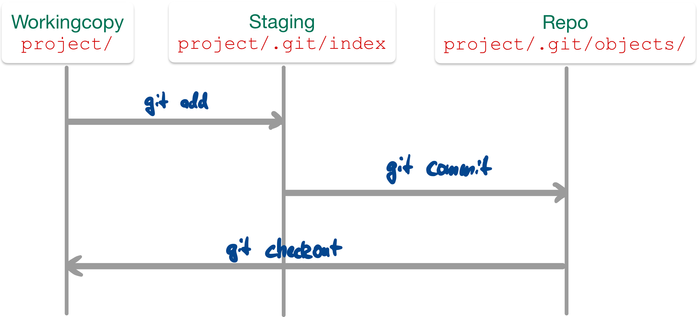
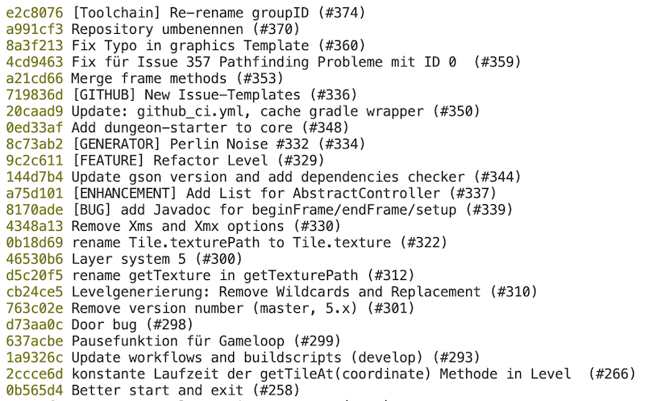
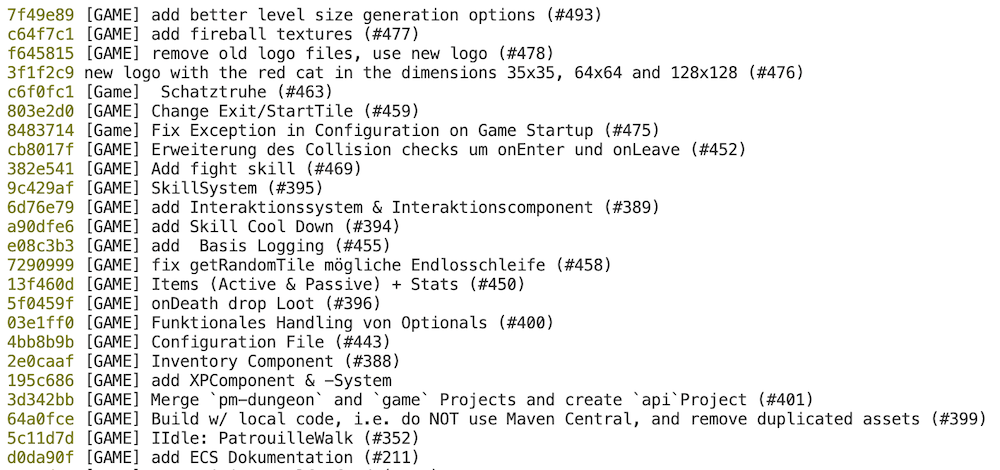

# Basics der Versionsverwaltung mit Git (lokale Repos)

> [!IMPORTANT]
>
> <details open>
>
> <summary><strong>🎯 TL;DR</strong></summary>
>
> Änderungen an Dateien (in der Workingcopy) werden mit `git add` zum
> “Staging” (Index) hinzugefügt. Dies ist eine Art Sammelbereich für
> Änderungen, die mit dem nächsten Commit in das Repository überführt
> werden. Neue (bisher nicht versionierte Dateien) müssen ebenfalls
> zunächst mit `git add` zum Staging hinzugefügt werden.
>
> Änderungen kann man mit `git log` betrachten, dabei erhält man u.a.
> eine Liste der Commits und der jeweiligen Commmit-Messages.
>
> Mit `git diff` kann man gezielt Änderungen zwischen Commits oder
> Branches betrachten.
>
> Mit `git tag` kann man bestimmte Commits mit einem “Stempel”
> (zusätzlicher Name) versehen, um diese leichter finden zu können.
>
> Wichtig sind die Commit-Messages: Diese sollten eine kurze
> Zusammenfassung haben, die **aktiv** formuliert wird (was ändert
> dieser Commit: “Formatiere den Java-Code entsprechend Style”; nicht
> aber “Java-Code nach Style formatiert”). Falls der Kommentar länger
> sein soll, folgt eine Leerzeile auf die erste Zeile (Zusammenfassung)
> und danach ein Block mit der längeren Erklärung.
> </details>

> [!TIP]
>
> <details open>
>
> <summary><strong>🎦 Videos</strong></summary>
>
> - [VL Git Basics](https://youtu.be/GxJI8nmZVE8)
> - [Demo New Files](https://youtu.be/ITF8wj8GluM)
> - [Demo Arbeitsablauf: Datei ändern - stagen -
>   committen](https://youtu.be/SFIVudlVUhg)
> - [Demo Amend](https://youtu.be/0uczjI7wsrQ)
> - [Demo Log](https://youtu.be/vmb-PZ1Efkg)
> - [Demo Diff](https://youtu.be/XB8lfGuU6ZI)
> - [Demo Tag](https://youtu.be/F1W0RqrxCho)
>
> </details>

## Versionsverwaltung mit Git: Typische Arbeitsschritte

1.  Repository anlegen (oder clonen)

<!-- -->

1.  Dateien neu erstellen (und löschen, umbenennen, verschieben)
2.  Änderungen einpflegen (“committen”)
3.  Änderungen und Logs betrachten
4.  Änderungen rückgängig machen
5.  Projektstand markieren (“taggen”)

<!-- -->

1.  Entwicklungszweige anlegen (“branchen”)
2.  Entwicklungszweige zusammenführen (“mergen”)

<!-- -->

1.  Änderungen verteilen (verteiltes Arbeiten, Workflows)

## Dateien unter Versionskontrolle stellen

<picture><source media="(prefers-color-scheme: light)" srcset="images/workflow_light.png"><source media="(prefers-color-scheme: dark)" srcset="images/workflow_dark.png"></picture>

1.  `git add .` (oder `git add <file>`)

    =\> Stellt alle Dateien (bzw. die Datei `<file>`) im aktuellen
    Verzeichnis unter Versionskontrolle

2.  `git commit`

    =\> Fügt die Dateien dem Repository hinzu

**Abfrage mit `git status`**

## Änderungen einpflegen

<picture><source media="(prefers-color-scheme: light)" srcset="images/lifecycle_light.png"><source media="(prefers-color-scheme: dark)" srcset="images/lifecycle_dark.png"></picture>

- Abfrage mit: `git status`
- “Staging” von modifizierten Dateien: `git add <file>`
- Committen der Änderungen im Stage: `git commit`

*Anmerkung*: Alternativ auch mit `git commit -m "Kommentar"`, um das
Öffnen des Editors zu vermeiden … geht einfach schneller ;)

Das “staging area” stellt eine Art Zwischenebene zwischen Working Copy
und Repository dar: Die Änderungen sind temporär “gesichert”, aber noch
nicht endgültig im Repository eingepflegt (“committed”).

Man kann den Stage dazu nutzen, um Änderungen an einzelnen Dateien zu
sammeln und diese dann (in einem Commit) gemeinsam einzuchecken.

Man kann den Stage in der Wirkung umgehen, indem man alle in der Working
Copy vorliegenden Änderungen per `git commit -a -m "Kommentar"`
eincheckt. Der Schalter “`-a`” nimmt alle vorliegenden Änderungen an
**bereits versionierten** Dateien, fügt diese dem Stage hinzu und führt
dann den Commit durch. Das ist das von SVN bekannte Verhalten. Achtung:
Nicht versionierte Dateien bleiben dabei außen vor!

## Letzten Commit ergänzen

- `git commit --amend -m "Eigentlich wollte ich das so sagen"`

  Wenn keine Änderungen im Stage sind, wird so die letzte Commit-Message
  geändert.

<!-- -->

- `git add <file>; git commit --amend`

  Damit können vergessene Änderungen an der Datei `<file>` zusätzlich im
  letzten Commit aufgezeichnet werden.

  In beiden Fällen ändert sich die Commit-ID!

## Weitere Datei-Operationen: hinzufügen, umbenennen, löschen

- Neue (unversionierte) Dateien und Änderungen an versionierten Dateien
  zum Staging hinzufügen: `git add <file>`
- Löschen von Dateien (Repo+Workingcopy): `git rm <file>`
- Löschen von Dateien (nur Repo): `git rm --cached <file>`
- Verschieben/Umbenennen: `git mv <fileAlt> <fileNeu>`

Aus Sicht von Git sind zunächst alle Dateien “untracked”, d.h. stehen
nicht unter Versionskontrolle.

Mit `git add <file>` (und `git commit`) werden Dateien in den Index (den
Staging-Bereich, d.h. nach dem Commit letztlich in das Repository)
aufgenommen. Danach stehen sie unter “Beobachtung” (Versionskontrolle).
So lange, wie eine Datei identisch zur Version im Repository ist, gilt
sie als unverändert (“unmodified”). Eine Änderung führt entsprechend zum
Zustand “modified”, und ein `git add <file>` speichert die Änderungen im
Stage. Ein Commit überführt die im Stage vorgemerkte Änderung in das
Repo, d.h. die Datei gilt wieder als “unmodified”.

Wenn eine Datei nicht weiter versioniert werden soll, kann sie aus dem
Repo entfernt werden. Dies kann mit `git rm <file>` geschehen, wobei die
Datei auch aus der Workingcopy gelöscht wird. Wenn die Datei erhalten
bleiben soll, aber nicht versioniert werden soll (also als “untracked”
markiert werden soll), dann muss sie mit `git rm --cached <file>` aus
der Versionskontrolle gelöscht werden. Achtung: Die Datei ist dann nur
ab dem aktuellen Commit gelöscht, d.h. frühere Revisionen enthalten die
Datei noch!

Wenn eine Datei umbenannt werden soll, geht das mit
`git mv <fileAlt> <fileNeu>`. Letztlich ist dies nur eine Abkürzung für
die Folge `git rm --cached <fileAlt>`, manuelles Umbenennen der Datei in
der Workingcopy und `git add <fileNeu>`.

## Commits betrachten

- Liste aller Commits: `git log`
  - `git log -<n>` oder `git log --since="3 days ago"` Meldungen
    eingrenzen …
  - `git log --stat` Statistik …
  - `git log --author="pattern"` Commits eines Autors
  - `git log <file>` Änderungen einer Datei

<!-- -->

- Inhalt eines Commits: `git show`

## Änderungen und Logs betrachten

- `git diff [<file>]`

  Änderungen zwischen Workingcopy und letztem Commit (ohne Stage)

  Das “staging area” wird beim Diff von Git behandelt, als wären die
  dort hinzugefügten Änderungen bereits eingecheckt (genauer: als
  letzter Commit im aktuellen Branch im Repo vorhanden). D.h. wenn
  Änderungen in einer Datei mittels `git add <datei>` dem Stage
  hinzugefügt wurden, zeigt `git diff <datei>` keine Änderungen an!

<!-- -->

- `git diff commitA commitB`

  Änderungen zwischen Commits

<!-- -->

- Blame: `git blame <file>`

  Wer hat was wann gemacht?

## Dateien ignorieren: *.gitignore*

- Nicht alle Dateien gehören ins Repo:
  - generierte Dateien: `.class`
  - temporäre Dateien
- Datei `.gitignore` anlegen und committen
  - Wirkt auch für Unterordner
  - Inhalt: Reguläre Ausdrücke für zu ignorierende Dateien und Ordner

``` gitignore
    # Compiled source #
    *.class
    *.o
    *.so

    # Packages #
    *.zip

    # All directories and files in a directory #
    bin/**/*
```

<p align="right"><a href="https://linux.die.net/man/5/gitignore">man 5 gitignore</a></p>

## Zeitmaschine

- Änderungen in Workingcopy rückgängig machen
  - Änderungen nicht in Stage: `git checkout <file>` oder
    `git restore <file>`
  - Änderungen in Stage: `git reset HEAD <file>` oder
    `git restore --staged <file>`

  =\> Hinweise von `git status` beachten!

<!-- -->

- Datei aus altem Stand holen:
  - `git checkout <commit> <file>`, oder
  - `git restore --source <commit> <file>`
- Commit verwerfen, Geschichte neu: `git revert <commit>`

*Hinweis*: In den neueren Versionen von Git ist der Befehl `git restore`
hinzugekommen, mit dem Änderungen rückgängig gemacht werden können. Der
bisherige Befehl `git checkout` steht immer noch zur Verfügung und
bietet über `git restore` hinaus weitere Anwendungsmöglichkeiten.

- Stempel (Tag) vergeben: `git tag <tagname> <commit>`
- Tags anzeigen: `git tag` und `git show <tagname>`

## Wann und wie committen?

<div align="center">

**Jeder Commit stellt einen Rücksetzpunkt dar!**

</div>

Typische Regeln:

- Kleinere “Häppchen” einchecken: ein Feature oder Task (das nennt man
  auch *atomic commit*: das kleinste Set an Änderungen, die gemeinsam
  Sinn machen und die ggf. gemeinsam zurückgesetzt werden können)
- Logisch zusammenhängende Änderungen gemeinsam einchecken
- Projekt muss nach Commit compilierbar sein
- Projekt sollte nach Commit lauffähig sein

Ein Commit sollte in sich geschlossen sein, d.h. die kleinste Menge an
Änderungen enthalten, die gemeinsam einen Sinn ergeben und die (bei
Bedarf) gemeinsam zurückgesetzt oder verschoben werden können. Das nennt
man auch **atomic commit**.

Wenn Sie versuchen, die Änderungen in Ihrem Commit zu beschreiben (siehe
nächste Folie “Commit-Messages”), dann werden Sie einen *atomic commit*
mit einem kurzen Satz (natürlich im Imperativ!) beschreiben können. Wenn
Sie mehr Text brauchen, haben Sie wahrscheinlich keinen *atomic commit*
mehr vor sich.

**Lesen Sie dazu auch [How atomic Git commits dramatically increased my
productivity - and will increase yours
too](https://dev.to/samuelfaure/how-atomic-git-commits-dramatically-increased-my-productivity-and-will-increase-yours-too-4a84).**

## Schreiben von Commit-Messages: WARUM?!

Schauen Sie sich einmal einen Screenshot eines
`git log --oneline 61e48f0..e2c8076` im
[Dungeon-CampusMinden/Dungeon](https://github.com/Dungeon-CampusMinden/Dungeon)
an:

<picture><source media="(prefers-color-scheme: light)" srcset="images/screenshot_git_log_light.png"><source media="(prefers-color-scheme: dark)" srcset="images/screenshot_git_log_dark.png"></picture>

Nun stellen Sie sich vor, Sie sind auf der Suche nach Informationen,
suchen einen bestimmten Commit oder wollen eine bestimmte Änderung
finden …

Wenn man das genauer analysiert, dann stören bestimmte Dinge:

- Mischung aus Deutsch und Englisch
- “Vor-sich-hin-Murmeln”: “Layer system 5”
- Teileweise werden Tags genutzt wie `[BUG]`, aber nicht durchgängig
- Mischung zwischen verschiedenen Formen: “Repo umbenennen”, “Benenne
  Repo um”, “Repo umbenannt”
- Unterschiedliche Groß- und Kleinschreibung
- Sehr unterschiedlich lange Zeilen/Kommentare

**Das Beachten einheitlicher Regeln ist enorm wichtig!**

Leider sagt sich das so leicht - in der Praxis macht man es dann doch
schnell wieder unsauber. Dennoch, auch im Dungeon-Repo gibt es einen
positiven Trend (`git log --oneline 8039d6c..7f49e89`):

<picture><source media="(prefers-color-scheme: light)" srcset="images/screenshot_git_log_recent_light.png"><source media="(prefers-color-scheme: dark)" srcset="images/screenshot_git_log_recent_dark.png"></picture>

Typische Regeln und Konventionen tauchen überall auf, beispielsweise in
Chacon und Straub ([2014](#ref-Chacon2014)) oder bei Tim Pope (siehe
nächstes Beispiel) oder bei [“How to Write a Git Commit
Message”](https://cbea.ms/git-commit/).

``` markdown
Short (50 chars or less) summary of changes

More detailed explanatory text, if necessary.  Wrap it to about
72 characters or so.  In some contexts, the first line is treated
as the subject of an email and the rest of the text as the body.
The blank line separating the summary from the body is critical
(unless you omit the body entirely); tools like rebase can get
confused if you run the two together.

Further paragraphs come after blank lines.

 - Bullet points are okay, too
 - Typically a hyphen or asterisk is used for the bullet, preceded
   by a single space, with blank lines in between, but conventions
   vary here
```

Quelle: [“A Note About Git Commit
Messages”](https://tbaggery.com/2008/04/19/a-note-about-git-commit-messages.html)
by [Tim Pope](https://tpo.pe/) on tbaggery.com

Denken Sie sich die Commit-Message als E-Mail an einen zukünftigen
Entwickler, der das in fünf Jahren liest!

Vom Aufbau her hat eine E-Mail auch eine Summary und dann den
eigentlichen Inhalt … Erklären Sie das **“WARUM”** der Änderung! (Das
“WER”, “WAS”, “WANN” wird bereits automatisch von Git aufgezeichnet …)

<div align="center">

**Lesen (und beachten) Sie unbedingt auch [“How to Write a Git Commit
Message”](https://cbea.ms/git-commit/)!**

</div>

## Wrap-Up

- Änderungen einpflegen zweistufig (`add`, `commit`)
- Status der Workingcopy mit `status` ansehen
- Logmeldungen mit `log` ansehen
- Änderungen auf einem File mit `diff` bzw. `blame` ansehen
- Projektstand markieren mit `tag`
- Ignorieren von Dateien/Ordnern: Datei `.gitignore`

## 📖 Zum Nachlesen

- Chacon und Straub ([2014, Kap. 2](#ref-Chacon2014))
- Atlassian Pty Ltd ([2022](#ref-AtlassianGit))
- Github Inc. ([2022](#ref-GitCheatSheet))

> [!NOTE]
>
> <details>
>
> <summary><strong>✅ Lernziele</strong></summary>
>
> - k3: Umgang mit Dateien: Hinzufügen zum und Löschen aus Repo
> - k3: Umgang mit Änderungen: Hinzufügen zum Staging und Commit
> - k3: Herausfinden von Unterschieden, Ansehen der Historie
> - k3: Ignorieren von Dateien und Ordnern
>
> </details>

> [!TIP]
>
> <details>
>
> <summary><strong>🧩 Quizzes</strong></summary>
>
> - [Quiz Git Basics
>   (ILIAS)](https://www.hsbi.de/elearning/goto.php?target=tst_1106241&client_id=FH-Bielefeld)
>
> </details>

> [!TIP]
>
> <details>
>
> <summary><strong>🏅 Challenges</strong></summary>
>
> **Versionierung 101**
>
> 1.  Legen Sie ein Repository an.
> 2.  Fügen Sie Dateien dem Verzeichnis hinzu und stellen Sie *einige*
>     davon unter Versionskontrolle.
> 3.  Ändern Sie eine Datei und versionieren Sie die Änderung.
> 4.  Was ist der Unterschied zwischen “`git add .; git commit`” und
>     “`git commit -a`”?
> 5.  Wie finden Sie heraus, welche Dateien geändert wurden?
> 6.  Entfernen Sie eine Datei aus der Versionskontrolle, aber nicht aus
>     dem Verzeichnis!
> 7.  Entfernen Sie eine Datei komplett (Versionskontrolle und
>     Verzeichnis).
> 8.  Ändern Sie eine Datei und betrachten die Unterschiede zum letzten
>     Commit.
> 9.  Fügen Sie eine geänderte Datei zum Index hinzu. Was erhalten Sie
>     bei `git diff <datei>`?
> 10. Wie können Sie einen früheren Stand einer Datei wiederherstellen?
>     Wie finden Sie überhaupt den Stand?
> 11. Legen Sie sich ein Java-Projekt in Ihrer IDE an an. Stellen Sie
>     dieses Projekt unter Git-Versionskontrolle. Führen Sie die vorigen
>     Schritte mit Ihrer IDE durch.
>
> **Interaktive Git-Tutorials**: Schaffen Sie die Rätsel?
>
> - [Learn Git Branching](https://learngitbranching.js.org/)
> - [Oh My Git!](https://ohmygit.org/)
> - [Git Time](https://git.bradwoods.io/)
>
> </details>

------------------------------------------------------------------------

> [!NOTE]
>
> <details>
>
> <summary><strong>👀 Quellen</strong></summary>
>
> <div id="refs" class="references csl-bib-body hanging-indent">
>
> <div id="ref-AtlassianGit" class="csl-entry">
>
> Atlassian Pty Ltd. 2022. „Become a Git Guru.“
> <https://www.atlassian.com/git/tutorials>.
>
> </div>
>
> <div id="ref-Chacon2014" class="csl-entry">
>
> Chacon, S., und B. Straub. 2014. *Pro Git*. 2. Aufl. Apress.
> <https://git-scm.com/book/en/v2>.
>
> </div>
>
> <div id="ref-GitCheatSheet" class="csl-entry">
>
> Github Inc. 2022. „Git Cheat Sheets“. <https://training.github.com/>.
>
> </div>
>
> </div>
>
> </details>

------------------------------------------------------------------------


Unless otherwise noted, this work is licensed under CC BY-SA 4.0.

**Exceptions:**

- [“A Note About Git Commit
  Messages”](https://tbaggery.com/2008/04/19/a-note-about-git-commit-messages.html)
  by [Tim Pope](https://tpo.pe/) on tbaggery.com

<blockquote><p><sup><sub><strong>Last modified:</strong> a7fcc94 (tooling: rename origin to credits, 2025-08-22)<br></sub></sup></p></blockquote>
