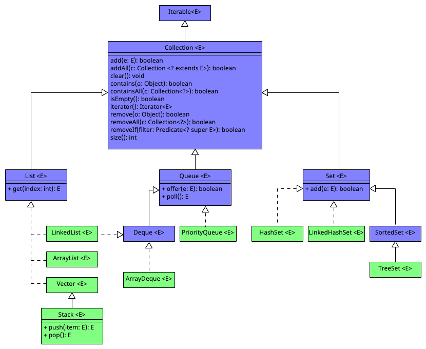
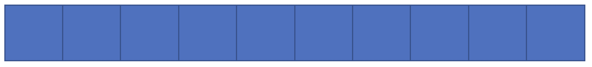
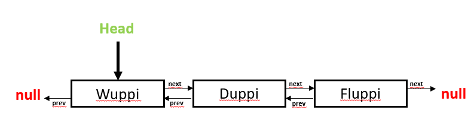
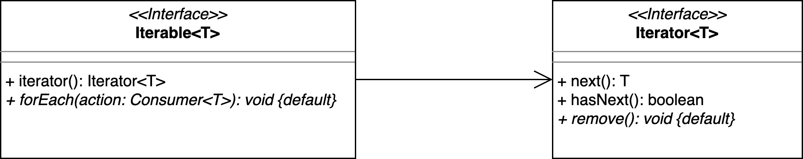
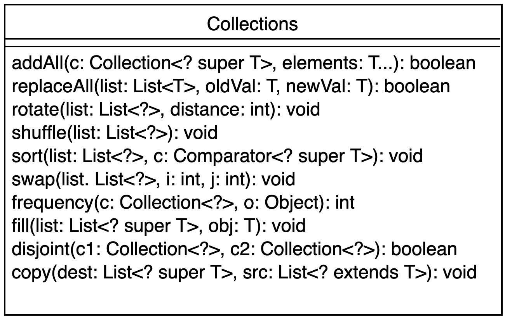
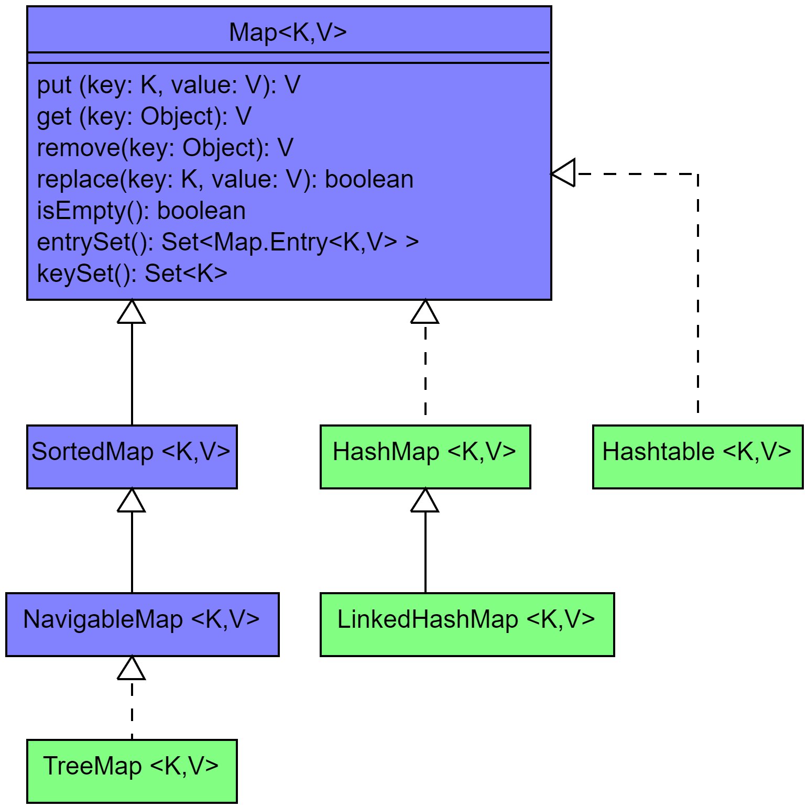
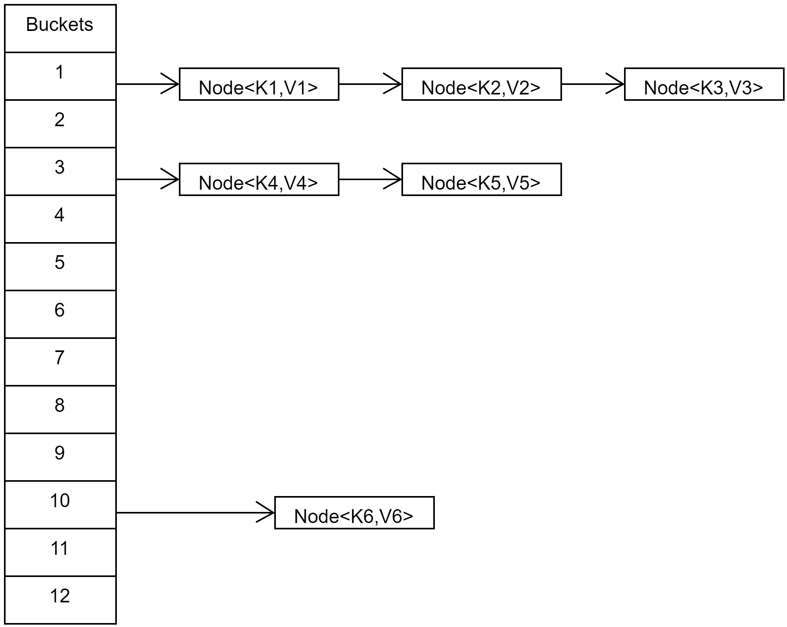
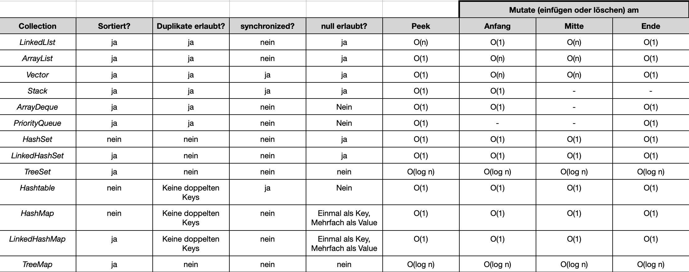

# Java Collections Framework

> [!IMPORTANT]
>
> <details open>
>
> <summary><strong>🎯 TL;DR</strong></summary>
>
> Die Collection-API bietet verschiedene Sammlungen an, mit denen man
> Objekte speichern kann: Listen, Queues, Mengen, … Für diese Typen gibt
> es jeweils verschiedene Implementierungen mit einem spezifischen
> Verhalten. Zusätzlich gibt es noch Maps für das Speichern von
> Key/Value-Paaren, dabei wird für die Keys eine Hash-Tabelle
> eingesetzt.
>
> Die Hilfs-Klasse `Collections` bietet statische Hilfs-Methoden, die
> auf `Collection<T>`s anwendbar sind.
>
> Wenn man eigene Klassen in der Collection-API oder in Map benutzen
> möchte, sollte man den “equals-hashCode-Contract” berücksichtigen.
> </details>

> [!TIP]
>
> <details open>
>
> <summary><strong>🎦 Videos</strong></summary>
>
> - [VL Collections](https://youtu.be/QRYVt9FNY-4)
>
> </details>

## Motivation: Snippet aus einer Klasse im PM-Dungeon

``` java
private List<Entity> entities = new ArrayList<>();

public void add(Entity e){
    if (!entities.contains(e)) entities.add(e);
}
```

Die war ein reales Beispiel aus der Entwicklung des PM-Dungeon.

Es wurde eine `ArrayList<T>` zum Verwalten der Entitäten genutzt.
Allerdings sollte jedes Element nur einmal in der Liste vorkommen,
deshalb wurde beim Einfügen einer Entität geprüft, ob diese bereits in
der Liste ist.

Hier wird die **falsche Datenstruktur** genutzt!

Eine Liste kann ein Objekt mehrfach enthalten, eine Menge (*Set*)
hingegen kann ein Objekt nur *einmal* enthalten.

## Collection-API in Java

<picture><source media="(prefers-color-scheme: light)" srcset="images/collection_light.png"><source media="(prefers-color-scheme: dark)" srcset="images/collection_dark.png"></picture>

*Hinweis*: Die abstrakten (Zwischen-) Klassen wurden im obigen UML aus
Gründen der Übersichtlichkeit *nicht* aufgeführt. Aus den selben Gründen
sind auch nur ausgewählte Methoden aufgenommen worden.

*Hinweis*: Blau = Interface, Grün = Klasse.

`Collection<T>` ist ein zentrales Interface im JDK und stellt die
gemeinsame API der Collection-Klassen dar. Klassen, die `Collection<T>`
implementieren, speichern und verwalten eine Menge an Objekten.

Unter anderem gibt es die aus dem Modul “ADS” bekannten Datentypen wie
Listen, Sets, Queues etc.

Man unterscheidet zwischen “sorted” (geordnete) Collections, welche eine
bestimmte Reihenfolge der Elemente halten (Reihenfolge des Einfügens,
aufsteigende Werte etc.) und “unsorted” (ungeordnete) Collections,
welche keine bestimmte Reihenfolge halten.

Eine Übersicht, welche Collection welche Datenstruktur implementiert,
kann unter [“Collection
Implementations”](https://docs.oracle.com/en/java/javase/17/docs/api/java.base/java/util/doc-files/coll-overview.html)
eingesehen werden.

- `List<T>`-Collections sind eine geordnete Liste an Objekten. Per
  Index-Zugriff können Objekte an jeder Stelle der Liste zugegriffen
  (oder hinzugefügt) werden.
- `Queue<T>`-Collections sind eine geordnete Sammlung von Objekten.
  Objekte können nur am Ende der Queue hinzugefügt werden und nur am
  Anfang der Queue (der Head) gelesen oder entnommen werden (“first in
  first out”).
- `Set<T>`-Collections sind eine (i.d.R.!) ungeordnete Menge an
  Objekten, die stets nur einmal in der Set enthalten sein können. In
  einem Set kann nicht direkt auf ein Objekt zugegriffen werden. Es kann
  aber geprüft werden, ob ein spezifisches Objekt in einer Set
  gespeichert ist.

**Wichtig**: `List<T>`, `Set<T>`, `Queue<T>` und `Map<K,V>` sind
**Interfaces**, definieren also bestimmte Schnittstellen, die sich so
wie aus ADS her bekannt verhalten. Diese können jeweils mit sehr
unterschiedlichen Datenstrukturen implementiert werden und können
dadurch auch intern ein anderes Verhalten haben (sortiert vs. nicht
sortiert, Zugriffszeiten, …).

Siehe auch [Interface
Collection](https://docs.oracle.com/en/java/javase/17/docs/api/java.base/java/util/Collection.html).

## Listen: *ArrayList*

``` java
private List<Entity> entities = new ArrayList<>();
```

<picture><source media="(prefers-color-scheme: light)" srcset="images/arraylist_light.png"><source media="(prefers-color-scheme: dark)" srcset="images/arraylist_dark.png"></picture>

[Link zu einer netten
Animation](https://github.com/Programmiermethoden-CampusMinden/PM-Lecture/blob/master/markdown/java-jvm/images/arraylist.gif)

Eine `ArrayList<T>` ist von außen betrachtet ein sich dynamisch
vergrößerndes Array.

Intern wird allerdings ein statisches(!) Array benutzt. Wenn dieses
Array voll ist, wird es um 50% vergrößert und alle Inhalte in das neue
Array kopiert. Davon merkt man als Nutzer aber nichts.

Dank es Arrays kann auf ein Element per Index mit O(1) zugegriffen
werden.

Wird ein Element aus der Liste gelöscht, rücken alle Nachfolgenden
Einträge in der Liste einen Index auf (interner Kopiervorgang).

Deshalb ist eine `ArrayList<T>` effizient in der Abfrage und
Manipulation von Einträgen, aber deutlich weniger effizient beim
Hinzufügen und Löschen von Einträgen.

Per Default wird eine `ArrayList<T>` mit einem Array der Länge 10
angelegt, sobald das erste Element eingefügt wird. Man kann die
Startgröße auch im Konstruktoraufruf der `ArrayList<T>` bestimmen:
beispielsweise `new ArrayList<>(20)`.

Die Methoden einer `ArrayList<T>` sind nicht `synchronized`.

## Listen: *LinkedList*

<picture><source media="(prefers-color-scheme: light)" srcset="images/linkedlist_light.png"><source media="(prefers-color-scheme: dark)" srcset="images/linkedlist_dark.png"></picture>

[Link zu einer netten
Animation](https://github.com/Programmiermethoden-CampusMinden/PM-Lecture/blob/master/markdown/java-jvm/images/linkedlist.gif)

Eine `LinkedList<T>` ist eine Implementierung einer doppelt verketteten
Liste (diese kennen Sie bereits aus ADS) in Java.

Jeder Eintrag wird als Knoten repräsentiert, der den eigentlichen Wert
speichert und zusätzlich je einen Verweis auf den Vorgänger- und
Nachfolger-Knoten hat.

Der Head der `LinkedList<T>` zeigt auf den Anfang der Liste, der
Nachfolger des letzten Eintrag ist immer `null`.

Für den Zugriff auf ein Element muß man die `LinkedList<T>` traversieren
und beginnt dabei am Anfang der Liste, deshalb ist ein Zugriff O(n).

Neue Elemente können effizient an das Ende der Liste eingefügt werden,
indem der letzte Eintrag einen Verweis auf den neuen Knoten bekommt:
O(1) (sofern man sich nicht nur den Start der Liste merkt, sondern auch
das aktuelle Ende).

Wenn ein Element aus der Liste gelöscht wird, muss dieses zunächst
gefundenen werden und die Liste danach neu verkettete werden: O(n).

Die Methoden einer `LinkedList<T>` sind nicht `synchronized`.

## *Vector* und *Stack*

- `Vector<T>`:
  - Ein `Vector<T>` ähnelt einer `ArrayList<T>`
  - Das Array eines Vector wird jedoch verdoppelt, wenn es vergrößert
    wird
  - Die Methoden von `Vector<T>` sind `synchronized`

<!-- -->

- `Stack<T>`:
  - Schnittstelle: “last in first out”-Prinzip
    - `push(T)`: Pushe Element oben auf den Stack
    - `pop(): T`: Hole oberstes Element vom Stack
  - Tatsächlich aber: `class Stack<E> extends Vector<E>`

## Iterierbarkeit: *Iterable* und *Iterator*

``` java
private List <Entity> entities = new ArrayList<>();

for (Entity e : entities) { ... }
entities.forEach(x -> ...);
```

<picture><source media="(prefers-color-scheme: light)" srcset="images/iteratoruml_light.png"><source media="(prefers-color-scheme: dark)" srcset="images/iteratoruml_dark.png"></picture>

Die Klassen aus der Collection-API implementieren das Interface
`Iterable<T>` und sind damit iterierbar. Man kann sie darüber in einer
klassischen `for`-Schleife nutzen, oder mit der Methode `forEach()`
direkt über die Sammlung laufen.

Intern wird dabei ein passender `Iterator<T>` erzeugt, der die Elemente
der Sammlung schrittweise mit der Methode `next()` zurückgibt. Mithilfe
eines Cursor merkt sich der Iterator, bei welchem Eintrag der
Datenstruktur er aktuell ist. Mit der Methode `hasNext()`kann geprüft
werden, ob noch ein weiteres Element über den Iterator aus der
Datenstruktur verfügbar ist.

Mit `remove()`kann das letzte zurückgegebene Element aus der
Datenstruktur entfernt werden. Diese Methode ist im Interface als
Default-Methode implementiert.

Damit kann man die Datenstrukturen auf eine von der Datenstruktur
vorgegebene Weise ablaufen, beispielsweise einen Binärbaum.

[Link zu einer netten
Animation](https://github.com/Programmiermethoden-CampusMinden/PM-Lecture/blob/master/markdown/java-jvm/images/iterator.gif)

Man kann auch selbst für eigene Klassen einen passenden `Iterator<T>`
implementieren, der zum Ablaufen der Elemente der eigenen Klasse genutzt
werden kann. Damit die eigene Klasse auch in einer `for`-Schleife
genutzt werden kann, muss sie aber auch noch `Iterable<T>`
implementieren.

<p align="right"><a href="https://github.com/Programmiermethoden-CampusMinden/PM-Lecture/tree/master/markdown/java-jvm/src/collections/iterator_example/">Beispiel: iterator_example.*</a></p>

## Hilfsklasse *Collections*

<picture><source media="(prefers-color-scheme: light)" srcset="images/collections_light.png"><source media="(prefers-color-scheme: dark)" srcset="images/collections_dark.png"></picture>

`Collections` ist eine Utility-Klasse mit statischen Methoden, die auf
`Collection<T>`s ausgeführt werden. Diese Methoden nutzen das
`Collection<T>`-Interface und/oder die `Iterable<T>`-Schnittstelle.

Siehe auch [Class
Collections](https://docs.oracle.com/en/java/javase/17/docs/api/java.base/java/util/Collections.html).

Der Hintergrund für diese in Java nicht unübliche Aufsplittung in ein
Interface und eine Utility-Klasse ist, dass bis vor kurzem Interface nur
Schnittstellen definieren konnten. Erst seit einigen Java-Versionen kann
in Interfaces auch Verhalten definiert werden (Default-Methoden). Aus
heutiger Sicht würde man also vermutlich die statischen Methoden in der
Klasse `Collections` eher direkt als Default-Methoden im Interface
`Collection<T>` implementieren und bereitstellen, statt eine separate
Utility-Klasse zu definieren.

## *Map*

<picture><source media="(prefers-color-scheme: light)" srcset="images/map_light.png"><source media="(prefers-color-scheme: dark)" srcset="images/map_dark.png"></picture>

*Hinweis*: Die abstrakten (Zwischen-) Klassen wurden im obigen UML aus
Gründen der Übersichtlichkeit *nicht* aufgeführt. Aus den selben Gründen
sind auch nur ausgewählte Methoden aufgenommen worden.

*Hinweis*: Blau = Interface, Grün = Klasse.

*Hinweis*: Tatsächlich ist der Typ des Keys in den Methoden `get()` und
`remove()` mit `Object` spezifiziert und nicht mit dem Typ-Parameter
`K`. Das ist aus meiner Sicht eine Inkonsistenz in der API.

Eine `Map<K,V>` speichert Objekte als Key/Value-Paar mit den Typen `K`
(Key) und `V` (Value).

Dabei sind die Keys in einer Map einzigartig und werden verwendet, um
auf das jeweilige Value zuzugreifen. Ein Value kann entsprechend (mit
unterschiedlichen Keys) mehrfach im einer Map enthalten sein.

Es gibt eine Reihe verschiedener Implementierungen, die unterschiedliche
Datenstrukturen einsetzen, beispielsweise:

- `HashMap<K,V>` hält keine Ordnung in den Einträgen. Verwendet den
  Hashwert, um Objekte zu speichern. Zugriff auf Einträge in einer
  `HashMap` ist O(1).
- `LinkedHashMap<K,V>` hält die Einträge in der Reihenfolge, in der sie
  eingefügt wurden.
- `TreeMap<K,V>` hält die Einträge in aufsteigender Reihenfolge.

Siehe auch [Interface
Map](https://docs.oracle.com/en/java/javase/17/docs/api/java.base/java/util/Map.html).

## *HashMap*

<picture><source media="(prefers-color-scheme: light)" srcset="images/hashmap_light.png"><source media="(prefers-color-scheme: dark)" srcset="images/hashmap_dark.png"></picture>

Eine `HashMap<K,V>` speichert die Elemente in mehreren einfach
verketteten Listen. Dafür verwendet sie die innere Klasse `Node<K,V>`.

Die Heads, die auf den Anfang einer Liste zeigen, werden in “Buckets”
gespeichert. Initial besitzt eine HashMap 12 Buckets, diese werden bei
Bedarf erweitert.

Um einen Eintrag hinzufügen, wird zunächst aus dem `hashCode()` des
Key-Objektes mithilfe der Hash-Funktion der Index des Buckets berechnet.
Ist der Bucket gefunden, wird geprüft, ob das Objekt dort schon
vorkommt: Mit dem `hashCode()` des Key-Objektes werden alle Objekte in
der Liste des Buckets verglichen. Wenn es Einträge mit dem selben
`hashCode()` in der Liste gibt, wird mit `equals` geprüft, ob die
Key-Objekte identisch sind. Ist dies der Fall, wird der existierende
Eintrag überschrieben, anderenfalls wird der neue Eintrag an das Ende
der Liste hinzugefügt.

Implementierungsdetail: Wenn die Listen zu groß werden, wird die
Hashtabelle neu angelegt mit ungefähr der doppelten Anzahl der Einträge
(Buckets) und die alten Einträge per *Re-Hash* neu verteilt (vgl. [Class
HashMap](https://docs.oracle.com/en/java/javase/17/docs/api/java.base/java/util/HashMap.html)).

`HashMap<K,V>` Methoden sind nicht `synchronized`.

`HashMap<K,V>` unterstützt einen `null`-Key. Es darf beliebig viele
`null`-Values geben.

Die Unterklasse `LinkedHashMap<K,V>` kann Ordnung zwischen den Elementen
halten. Dafür wird eine doppelt verkettete Liste verwendet.

<p align="right"><a href="https://github.com/Programmiermethoden-CampusMinden/PM-Lecture/blob/master/markdown/java-jvm/src/collections/hash_example/HashCodeExample.java">Beispiel: hash_example.HashCodeExample</a></p>

## *Hashtable*

- Nicht zu verwechseln mit der Datenstruktur: Hash-Tabellen (!)
- `Hashtable<K,V>` ist vergleichbar mit einer `HashMap<K,V>`
- `Hashtable<K,V>`-Methoden sind `synchronized`
- Kein Key oder Value darf `null` sein

## Spielregeln für *equals()*, *hashCode()* und *compareTo()*

### *equals()*

`boolean equals(Object o)` ist eine Methode Klasse `Object` und wird
genutzt, um Objekte auf Gleichheit zu prüfen. Die
Default-Implementierung von `equals()` in `Object` vergleicht die beiden
Objekte mit `==`, gibt also nur dann `true` zurück, wenn die beiden zu
vergleichenden Objekte die selbe Objekt-ID haben.

In der Praxis kann es sich anbieten, diese Methode zu überschreiben und
eigene Kriterien für Gleichheit aufzustellen.

Dabei sind Spielregeln zu beachten (für nicht-`null` Objekte `x`, `y`
und `z`):

1.  Reflexivität: `x.equals(x) == true`
2.  Symmetrie: `x.equals(y) == y.equals(x)`
3.  Transitivität: Wenn `x.equals(y) == true` und `y.equals(z) == true`,
    dann auch `x.equals(z) == true`
4.  Konsistenz: Mehrfache Aufrufe von `equals()` mit den selben Werten
    müssen immer das selbe Ergebnis liefern
5.  `x.equals(null) == false`

### *hashCode()*

Die Methode `int hashCode()` gibt den Hash-Wert eines Objektes zurück.
Der Hash-Wert eins Objektes wird genutzt, um dieses in einen
Hash-basierten Container abzulegen bzw. zu finden.

Der Rückgabewert der Methode `hashCode()` für ein Objekt bleibt über die
Laufzeit einer Anwendung immer identisch, solange sich die zur Prüfung
der Gleichheit genutzten Attribute nicht ändern.

### *compareTo()*

Die Methode `int compareTo()` (Interface `Comparable<T>`) vergleicht
Objekte und definiert damit eine Ordnung auf den Objekten. Während
`equals()` für die Prüfung auf Gleichheit eingesetzt wird, wird
`compareTo()` für die Sortierung von Objekten untereinander verwendet.

Spielregeln:

1.  `x.compareTo(y) < 0` wenn `x` “kleiner” als `y` ist
2.  `x.compareTo(y) > 0` wenn `x` “größer” als `y` ist
3.  `x.compareTo(y) = 0` wenn `x` “gleich” als `y` ist
4.  Symmetrie: `signum(x.compareTo(y)) == -signum(y.compareTo(x))`
5.  Transitivität: Wenn `x.compareTo(y) > 0` und `y.compareTo(z) > 0`,
    dann auch `x.compareTo(z) > 0`
6.  Wenn `x.compareTo(y) == 0`, dann auch
    `signum(x.compareTo(z)) == signum(y.compareTo(z))`

### Der *equals()*-*hashCode()*-*compareTo()*-Vertrag

**Wird `equals()` überschrieben, sollte auch `hashCode()` (passend)
überschrieben werden.**

1.  Wenn `x.equals(y) == true`, dann *muss* auch
    `x.hashCode() == y.hashCode()`

2.  Wenn `x.equals(y) == false`, *sollte* `x.hashCode() != y.hashCode()`
    sein (Unterschiedliche `hashCode()`-Werte für unterschiedliche
    Objekte verbessern allerdings die Leistung von Hash-Berechnungen,
    etwa in einer `HashMap<K,V>`!)

3.  Es wird sehr empfohlen, dass `equals()` und `compareTo()`
    konsistente Ergebnisse liefern: `x.compareTo(y) == 0` gdw.
    `x.equals(y) == true` (Dies *muss* aber nicht zwingend eingehalten
    werden, sorgt dann aber u.U. für unerwartete Nebeneffekte beim
    Umgang mit `Collection<T>` und `Map<K,V>`!)

<p align="right"><a href="https://github.com/Programmiermethoden-CampusMinden/PM-Lecture/blob/master/markdown/java-jvm/src/collections/hash_example/HashCodeExample.java">Beispiel: hash_example.HashCodeExample</a></p>

## Überblick

<picture><source media="(prefers-color-scheme: light)" srcset="images/collections_table_light.png"><source media="(prefers-color-scheme: dark)" srcset="images/collections_table_dark.png"></picture>

Komplexitätswerte beziehen sich auf den Regelfall. Sonderfälle wie das
Vergrößern des Array einer `ArrayList<T>` können für temporär erhöhte
Komplexität sorgen (das ist dem O-Kalkül aber egal).

## Wrap-Up

- Interface `Collection<T>`: Schnittstelle für
  Datenstrukturen/Sammlungen zur Verwaltung einer Menge von Objekten
- Klasse `Collections`: Statische Hilfs-Methoden (anwendbar auf
  `Collection<T>`s)
- `Iterable<T>` liefert einen `Iterator<T>` zur Iteration über eine
  `Collection<T>`
- Interface `Map<K,V>`: Speichern von Key/Value-Paaren
- `equals()`-`hashCode()`-`compareTo()`-Vertrag beachten

## 📖 Zum Nachlesen

- Oracle Corporation ([2022](#ref-LernJava))

> [!NOTE]
>
> <details>
>
> <summary><strong>✅ Lernziele</strong></summary>
>
> - k2: Was ist der Unterschied zwischen Collection\<T\> und List\<T\>?
> - k2: Was ist der Unterschied zwischen einer List\<T\>, einer
>   Queue\<T\> und einer Set\<T\>?
> - k2: Nennen Sie charakteristische Merkmale von ArrayList\<T\>,
>   LinkedList\<T\> und Vector\<T\>.
> - k2: Was ist der Unterschied zwischen einer Queue\<T\> und einem
>   Stack\<T\>?
> - k2: Was ist eine Map\<K,V\>? Welche Vertreter kennen Sie?
> - k3: Erklären Sie die ‘Spielregeln’ für die eigene Implementierung
>   von equals().
> - k3: Erklären Sie die ‘Spielregeln’ für die eigene Implementierung
>   von hashCode().
> - k3: Erklären Sie die ‘Spielregeln’ für die eigene Implementierung
>   von compareTo().
> - k3: Wie müssen und wie sollten equals(), hashCode() und compareTo()
>   miteinander arbeiten?
>
> </details>

> [!TIP]
>
> <details>
>
> <summary><strong>🧩 Quizzes</strong></summary>
>
> - [Quiz Collections
>   (ILIAS)](https://www.hsbi.de/elearning/goto.php?target=tst_1106513&client_id=FH-Bielefeld)
>
> </details>

------------------------------------------------------------------------

> [!NOTE]
>
> <details>
>
> <summary><strong>👀 Quellen</strong></summary>
>
> <div id="refs" class="references csl-bib-body hanging-indent">
>
> <div id="ref-LernJava" class="csl-entry">
>
> Oracle Corporation. 2022. „Learn Java“. <https://dev.java/learn/>.
>
> </div>
>
> </div>
>
> </details>

------------------------------------------------------------------------


Unless otherwise noted, this work is licensed under CC BY-SA 4.0.

<blockquote><p><sup><sub><strong>Last modified:</strong> 02b1db8 (markdown: reformat (#32), 2025-08-10)<br></sub></sup></p></blockquote>
