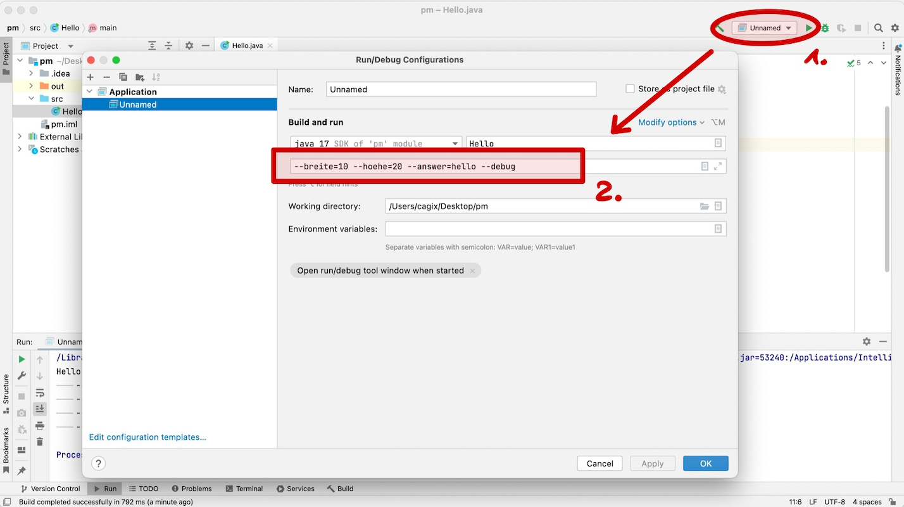

# Konfiguration eines Programms

> [!IMPORTANT]
>
> <details open>
>
> <summary><strong>🎯 TL;DR</strong></summary>
>
> Zu Konfiguration von Programmen kann man beim Aufruf
> Kommandozeilenparameter mitgeben. Diese sind in der über den
> Parameter`String[] args` in der `main(String[] args)`-Methode
> zugreifbar.
>
> Es gibt oft eine Kurzversion (“-x”) und/oder eine Langversion
> (“–breite”). Zusätzlich können Parameter noch ein Argument haben (“-x
> 12” oder “–breite=12”). Parameter können optional oder verpflichtend
> sein.
>
> Um dies nicht manuell auswerten zu müssen, kann man beispielsweise die
> Bibliothkek Apache Commons CLI benutzen.
>
> Ein anderer Weg zur Konfiguration sind Konfigurationsdateien, die man
> entsprechend einliest. Hier findet man häufig das “Ini-Format”, also
> zeilenweise “Key=Value”-Paare. Diese kann man mit der Klasse
> `java.util.Properties` einlesen, bearbeiten und speichern (auch als
> XML).
> </details>

> [!TIP]
>
> <details open>
>
> <summary><strong>🎦 Videos</strong></summary>
>
> - [VL Konfiguration](https://youtu.be/ImkyRx4UL9M)
> - [Demo Setzen von Kommandozeilenparametern
>   (IDE)](https://youtu.be/a3XUfDbD9uo)
> - [Demo Einbinden von Libs in IDE](https://youtu.be/cmMDxdT69ZQ)
> - [Demo Apache Commons CLI](https://youtu.be/DwKNQpLX4xI)
> - [Demo Properties](https://youtu.be/or1t_2vld2E)
>
> </details>

## Wie kann man Programme konfigurieren?

1.  Parameter beim Start mitgeben: Kommandozeilenparameter (CLI)

<!-- -->

1.  Konfigurationsdatei einlesen und auswerten

## Varianten von Kommandozeilenparameter

- Fixe Reihenfolge

  `java MyApp 10 20 hello debug`

<!-- -->

- Benannte Parameter I

  `java MyApp -x 10 -y 20 -answer hello -d`

<!-- -->

- Benannte Parameter II

  `java MyApp --breite=10 --hoehe=20 --answer=hello --debug`

Häufig Mischung von Kurz- und Langformen

Häufig hat man eine Kurzform der Optionen, also etwa “-x”. Dabei ist der
Name der Option in der Regel ein Zeichen lang. Es gibt aber auch
Abweichungen von dieser Konvention, denken Sie beispielsweise an
`java -version`.

In der Langform nutzt man dann einen aussagekräftigen Namen und stellt
zwei Bindestriche voran, also beispielsweise “–breite” (als Alternative
für “-x”).

Wenn Optionen Parameter haben, schreibt man in der Kurzform
üblicherweise “-x 10” (trennt also den Parameter mit einem Leerzeichen
von der Option) und in der Langform “–breite=10” (also mit einem “=”
zwischen Option und Parameter). Das sind ebenfalls Konventionen, d.h.
man kann prinzipiell auch in der Kurzform das “=” nutzen, also “-x=10”,
oder in der Langform mit einem Leerzeichen trennen, also “–breite 10”.

<p align="right"><a href="https://youtu.be/a3XUfDbD9uo">Demo IDE und CLI</a></p>

Hinweis IntelliJ: “`Edit Configurations`” =\> Kommandozeilenparameter
unter “`Build and run`” im entsprechenden Feld eintragen

<picture><source media="(prefers-color-scheme: light)" srcset="images/ide-cli_light.png"><source media="(prefers-color-scheme: dark)" srcset="images/ide-cli_dark.png"></picture>

## Auswertung Kommandozeilenparameter

- Kommandozeilenparameter werden als String-Array an `main()`-Methode
  übergeben:

  ``` java
  public static void main(String[] args) { }
  public static void main(String... argv) { }
  ```

  =\> Müssen “händisch” ausgewertet werden

*Anmerkung*: Nur Parameter! Nicht Programmname als erster Eintrag wie in
C …

## Beispiel Auswertung Kommandozeilenparameter

``` java
public static void main(String[] args) {
    int x = 100;
    String answer = "";
    boolean debug = false;

    // Parameter: -x=10 -answer=hello -debug
    // => args = ["-x=10", "-answer=hello", "-debug"]
    for (String param : args) {
        if (param.startsWith("-x")) { x = Integer.parseInt(param.substring(3)); }
        if (param.startsWith("-a")) { answer = param.substring(8); }
        if (param.startsWith("-d")) { debug = true; }
    }
}
```

### Kritik an manueller Auswertung Kommandozeilenparameter

- Umständlich und unübersichtlich
- Große `if-else`-Gebilde in `main()`
- Kurz- und Langform müssen getrennt realisiert werden
- Optionale Parameter müssen anders geprüft werden als Pflichtparameter
- Überlappende Parameternamen schwer aufzufinden
- Prüfung auf korrekten Typ nötig bei Parametern mit Werten
- Hilfe bei Fehlern muss separat realisiert und gepflegt werden

## Apache Commons: CLI

**Rad nicht neu erfinden!**

- Apache Commons bietet die CLI-Bibliothek zum Umgang mit
  Kommandozeilenparametern an:
  [commons.apache.org/cli](https://commons.apache.org/proper/commons-cli/)

Annäherung an fremde API:

- Lesen der verfügbaren Doku (PDF, HTML)
- Lesen der verfügbaren Javadoc
- Herunterladen der Bibliothek
- Einbinden ins Projekt

## Exkurs: Einbinden fremder Bibliotheken/APIs

### Eclipse

- Lib von
  [commons.apache.org](https://commons.apache.org/proper/commons-cli/download_cli.cgi)
  herunterladen und auspacken
- Neuen Unterordner im Projekt anlegen: `libs/`
- Bibliothek (`.jar`-Files) hinein kopieren
- Projektexplorer, Kontextmenü auf `.jar`-File: “`Add as Library`”
- Alternativ Menü-Leiste:
  “`Project > Properties > Java Build Path > Libraries > Add JARs`”

### IntelliJ

- Variante 1:
  - Lib von
    [commons.apache.org](https://commons.apache.org/proper/commons-cli/download_cli.cgi)
    herunterladen und auspacken
  - Neuen Unterordner im Projekt anlegen: `libs/`
  - Bibliothek (`.jar`-Files) hinein kopieren
  - Variante 1 (a):Projektexplorer, Kontextmenü auf `.jar`-File:
    “`Build Path > Add to Build Path`”
  - Variante 1 (b): Projekteigenschaften, Eintrag “Libraries”, “+”, “New
    Project Library”, “Java” und Jar-File auswählen
- Variante 2:
  - Projekteigenschaften, Eintrag “Libraries”, “+”, “New Project
    Library”, “From Maven” und “commons-cli:commons-cli:1.5.0” als
    Suchstring eingeben und die Suche abschließen

### Gradle oder Ant oder Maven

- Lib auf [Maven Central](https://search.maven.org/) suchen:
  “commons-cli:commons-cli” als Suchstring eingeben
- Passenden Dependency-Eintrag in das Build-Skript kopieren

### Kommandozeilenaufruf

- Class-Path bei Aufruf setzen:
  - Unix: `java -cp .:<jarfile>:<jarfile> <mainclass>`
  - Windows: `java -cp .;<jarfile>;<jarfile> <mainclass>`

  Achtung: Unter Unix (Linux, MacOS) wird ein Doppelpunkt zum Trennen
  der Jar-Files eingesetzt, unter Windows ein Semikolon!

Beispiel: `java -classpath .:/home/user/wuppy.jar MyApp`

Vorgriff auf Build-Skripte (spätere VL): Im hier gezeigten Vorgehen
werden die Abhängigkeiten manuell aufgelöst, d.h. die Jar-Files werden
manuell heruntergeladen (oder selbst kompiliert) und dem Projekt
hinzugefügt.

Alle später besprochenen Build-Skripte (Ant, Gradle) beherrschen die
automatische Auflösung von Abhängigkeiten. Dazu muss im Skript die
Abhängigkeit auf geeignete Weise beschrieben werden und wird dann beim
Kompilieren des Programms automatisch von spezialisierten Servern in der
im Skript definierten Version heruntergeladen. Dies funktioniert auch
bei rekursiven Abhängigkeiten …

## Überblick Umgang mit Apache Commons CLI

**Paket**: `org.apache.commons.cli`

1.  Definition der Optionen
    - Je Option eine Instanz der Klasse `Option`
    - Alle Optionen in Container `Options` sammeln
2.  Parsen der Eingaben mit `DefaultParser`
3.  Abfragen der Ergebnisse: `CommandLine`
4.  Formatierte Hilfe ausgeben: `HelpFormatter`

Die Funktionsweise der einzelnen Klassen wird in der Demo kurz
angerissen. Schauen Sie bitte zusätzlich in die Dokumentation.

<p align="right"><a href="https://github.com/Programmiermethoden-CampusMinden/PM-Lecture/blob/master/markdown/java-jvm/src/cli/Args.java">Demo: Einbinden von Libs, cli.Args</a></p>

## Laden und Speichern von Konfigurationsdaten

    #ola - ein Kommentar
    hoehe=2
    breite=9
    gewicht=12

- Konfigurationsdaten sind i.d.R. Schlüssel-Wert-Paare
  (`String`/`String`)

  =\> `java.util.Properties`

  Tatsächlich verbirgt sich ein `Hashtable` dahinter:

  ``` java
  public class Properties extends Hashtable<Object,Object>;
  ```

## Laden und Speichern von Konfigurationsdaten (cnt.)

- Properties anlegen und modifizieren

  ``` java
  Properties props = new Properties();
  props.setProperty("breite", "9");
  props.setProperty("breite", "99");
  String value = props.getProperty("breite");
  ```

<!-- -->

- Properties speichern: `Properties#store` und `Properties#storeToXML`

  ``` java
  public void store(Writer writer, String comments)
  public void store(OutputStream out, String comments)
  public void storeToXML(OutputStream os, String comment, String encoding)
  ```

- Properties laden: `Properties#load` und `Properties#loadFromXML`

  ``` java
  public void load(Reader reader)
  public void load(InputStream inStream)
  public void loadFromXML(InputStream in)
  ```

<p align="right"><a href="https://github.com/Programmiermethoden-CampusMinden/PM-Lecture/blob/master/markdown/java-jvm/src/cli/Props.java">Demo: cli.Props, Hinweis auf “Apache Commons Configuration”</a></p>

`java.util.Properties` sind eine einfache und im JDK bereits eingebaute
Möglichkeit, mit Konfigurationsdateien zu hantieren. Deutlich
umfangreichere Möglichkeiten bieten aber externe Bibliotheken,
beispielsweise “Apache Commons Configuration”
([commons.apache.org/configuration](https://commons.apache.org/proper/commons-configuration/)).

## Wrap-Up

- Kommandozeilenparameter als `String[]` in `main()`-Methode
- Manuelle Auswertung komplex =\> *Apache Commons CLI*
- Schlüssel-Wert-Paare mit `java.util.Properties` aus/in Dateien
  laden/speichern

## 📖 Zum Nachlesen

- Oracle Corporation ([2022](#ref-Java-SE-Tutorial))

> [!NOTE]
>
> <details>
>
> <summary><strong>✅ Lernziele</strong></summary>
>
> - k3: Auswertung von Kommandozeilenparametern in einem Programm
> - k3: Apache Commons CLI zur Verarbeitung von Kommandozeilenparametern
> - k3: Laden von Konfigurationsdaten mit java.util.Properties
>
> </details>

> [!TIP]
>
> <details>
>
> <summary><strong>🧩 Quizzes</strong></summary>
>
> - [Quiz Konfiguration
>   (ILIAS)](https://www.hsbi.de/elearning/goto.php?target=tst_1106514&client_id=FH-Bielefeld)
>
> </details>

------------------------------------------------------------------------

> [!NOTE]
>
> <details>
>
> <summary><strong>👀 Quellen</strong></summary>
>
> <div id="refs" class="references csl-bib-body hanging-indent">
>
> <div id="ref-Java-SE-Tutorial" class="csl-entry">
>
> Oracle Corporation. 2022. „The Java Tutorials“.
> <https://docs.oracle.com/javase/tutorial/>.
>
> </div>
>
> </div>
>
> </details>

------------------------------------------------------------------------


Unless otherwise noted, this work is licensed under CC BY-SA 4.0.

<blockquote><p><sup><sub><strong>Last modified:</strong> 02b1db8 (markdown: reformat (#32), 2025-08-10)<br></sub></sup></p></blockquote>
