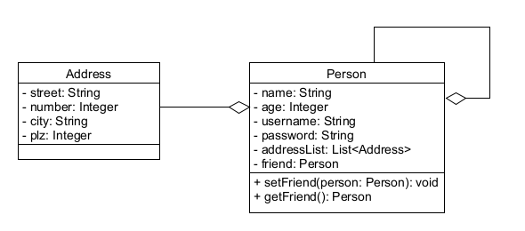

# Serialisierung von Objekten und Zuständen

> [!IMPORTANT]
>
> <details open>
>
> <summary><strong>🎯 TL;DR</strong></summary>
>
> Objekte lassen sich mit der Methode `void writeObject(Object)` in
> `ObjectOutputStream` einfach in einen Datenstrom schreiben. Dies kann
> beispielsweise eine Datei o.ä. sein. Mit Hilfe von
> `Object readObject()` in `ObjectInputStream` lassen sich Objekte aus
> dem Datenstrom auch wieder herstellen. Dies nennt man Serialisierung
> und De-Serialisierung.
>
> Um Objekte einer Klasse serialisieren zu können, muss diese das leere
> Interface `Serializable` implementieren (“Marker-Interface”). Damit
> wird quasi die Unterstützung in `Object*Stream` freigeschaltet.
>
> Wenn ein Objekt serialisiert wird, werden alle Attribute in den
> Datenstrom geschrieben, d.h. die Typen der Attribute müssen ihrerseits
> serialisierbar sein. Dies gilt für alle primitiven Typen und die
> meisten eingebauten Typen. Die Serialisierung erfolgt ggf. rekursiv,
> Zirkelreferenzen werden erkannt und aufgebrochen.
>
> `static` und `transient` Attribute werden nicht serialisiert.
>
> Beim De-Serialisieren wird das neue Objekt von der Laufzeitumgebung
> aus dem Datenstrom rekonstruiert. Dies geschieht direkt, es wird kein
> Konstruktor involviert.
>
> Beim Serialisieren wird für die Klasse des zu schreibenden Objekts
> eine `serialVersionUID` berechnet und mit gespeichert. Beim Einlesen
> wird dann geprüft, ob die serialisierten Daten zur aktuellen Version
> der Klasse passen. Da dies relativ empfindlich gegenüber Änderungen an
> einer Klasse ist, wird empfohlen, selbst eine `serialVersionUID` pro
> Klasse zu definieren.
> </details>

> [!TIP]
>
> <details open>
>
> <summary><strong>🎦 Videos</strong></summary>
>
> - [VL Serialisierung](https://youtu.be/wnwCMtKpXAQ)
> - [Demo Serialisierung](https://youtu.be/zpWLPIRPTeQ)
>
> </details>

## Motivation: Persistierung von Objekten und Spielzuständen

``` java
public class Studi {
    private final int credits = 42;
    private String name = "Hilde";

    ...
}
```

<div align="center">

Wie kann ich Objekte speichern und wieder laden?

</div>

Ich möchte ein Spiel (einen Lauf) im Dungeon abspeichern, um es später
fortsetzen zu können. Wie kann ich den aktuellen Zustand (also Level,
Monster, Held, Inventar, XP/Health/…) so speichern, dass ich später das
Spiel nach einem Neustart einfach fortsetzen kann?

## Serialisierung von Objekten

- Klassen müssen Marker-Interface `Serializable` implementieren

  “Marker-Interface”: Interface ohne Methoden. Ändert das Verhalten des
  Compilers, wenn eine Klasse dieses Interface implementiert: Weitere
  Funktionen werden “freigeschaltet”, beispielsweise die Fähigkeit,
  Klone zu erstellen (`Cloneable`) oder bei `Serializable` Objekte
  serialisierbar zu machen.

  Das ist in meinen Augen eine “Design-Sünde” in Java (neben der
  Einführung von `null`): Normalerweise definieren Interfaces eine
  Schnittstelle, die eine das Interface implementierende Klasse dann
  erfüllen muss. Damit agiert das Interface wie ein Typ. Hier ist das
  Interface aber leer, es wird also keine Schnittstelle definiert. Aber
  es werden damit stattdessen Tooling-Optionen aktiviert, was Interfaces
  vom Konzept her eigentlich nicht machen sollten/dürften - dazu gibt es
  Annotationen!

- Schreiben von Objekten (samt Zustand) in Streams

  ``` java
  ObjectOutputStream: void writeObject(Object)
  ```

  Die Serialisierung erfolgt dabei für alle Attribute (außer `static`
  und `transient`, s.u.) rekursiv.

  Dabei werden auch Zirkelreferenzen automatisch aufgelöst/unterbrochen.

- Lesen und “Wiedererwecken” der Objekte aus Streams

  ``` java
  ObjectInputStream: Object readObject()
  ```

  Dabei erfolgt KEIN Konstruktor-Aufruf!

## Einfaches Beispiel

``` java
public class Studi implements Serializable {
    private final int credits = 42;
    private String name = "Hilde";

    public static void writeObject(Studi studi, String filename) {
        try (FileOutputStream fos = new FileOutputStream(filename);
            ObjectOutputStream oos = new ObjectOutputStream(fos)) {
            oos.writeObject(studi);    oos.close();
        } catch (IOException ex) {}
    }

    public static Studi readObject(String filename) {
        Studi studi = null;
        try (FileInputStream fis = new FileInputStream(filename);
            ObjectInputStream ois = new ObjectInputStream(fis)) {
            studi = (Studi) ois.readObject();    ois.close();
        } catch (IOException | ClassNotFoundException ex) {}
        return studi;
    }
}
```

## Bedingungen für Objekt-Serialisierung

- Klassen implementieren Marker-Interface `Serializable`
- Alle Attribute müssen ebenfalls serialisierbar sein (oder Deklaration
  “`transient`”)
- Alle primitiven Typen sind per Default serialisierbar
- Es wird automatisch rekursiv serialisiert, aber jedes Objekt nur
  einmal (bei Mehrfachreferenzierung)
- Serialisierbarkeit vererbt sich

## Ausnahmen

- Als `static` deklarierte Attribute werden nicht serialisiert
- Als `transient` deklarierte Attribute werden nicht serialisiert
- Nicht serialisierbare Attribut-Typen führen zu
  `NotSerializableException`

## Version-UID

``` java
static final long serialVersionUID = 42L;
```

- Dient zum Vergleich der serialisierten Version und der aktuellen
  Klasse
- Über IDE generieren oder manuell vergeben
- Wenn das Attribut fehlt, wird eine Art Checksumme von der
  Runtime-Umgebung berechnet (basierend auf diversen Eigenschaften der
  Klasse)

Dieser Wert wird beim Einlesen verglichen: Das Objekt wird nur dann
wieder de-serialisiert, wenn die `serialVersionUID` mit der
einzulesenden Klasse übereinstimmt!

Bei automatischer Berechnung der `serialVersionUID` durch die JVM kann
jede kleine Änderung an der Klasse (beispielsweise Refactoring: Änderung
der Methodennamen) eine neue `serialVersionUID` zur Folge haben. Das
würde bedeuten, dass bereits serialisierte Objekte nicht mehr eingelesen
werden können, auch wenn sich nur Methoden o.ä. verändert haben und die
Attribute noch so vorhanden sind. Deshalb bietet es sich an, hier selbst
eine `serialVersionUID` zu definieren - dann muss man aber auch selbst
darauf achten, diese zu verändern, wenn sich wesentliche strukturelle
Änderungen an der Klasse ergeben!

## Bemerkungen

Es existieren diverse weitere Fallstricke und Probleme, siehe ([Bloch
2018](#ref-Bloch2018)) Kapitel 11 “Serialization”.

Man kann in den `ObjectOutputStream` nicht nur ein Objekt schreiben,
sondern mehrere Objekte und Variablen schreiben lassen. In dieser
Reihenfolge muss man diese dann aber auch wieder aus dem Stream
herauslesen (vgl. [Object
Streams](https://docs.oracle.com/javase/tutorial/essential/io/objectstreams.html)).

Man kann die zu serialisierenden Attribute mit der Annotation `@Serial`
markieren. Dies ist in der Wirkung ähnlich zu `@Override`: Der Compiler
prüft dann, ob die markierten Attribute wirklich serialisierbar sind und
würde sonst zur Compile-Zeit einen Fehler werfen.

Weitere Links:

- Tutorials:
  - https://docs.oracle.com/en/java/javase/17/docs/specs/serialization/input.html
  - https://www.baeldung.com/java-serialization
- API:
  - https://docs.oracle.com/en/java/javase/17/docs/api/java.base/java/io/ObjectOutputStream.html
  - https://docs.oracle.com/en/java/javase/17/docs/api/java.base/java/io/ObjectInputStream.html
  - https://docs.oracle.com/en/java/javase/17/docs/api/java.base/java/io/Serializable.html

<p align="right"><a href="https://github.com/Programmiermethoden-CampusMinden/PM-Lecture/blob/master/markdown/java-jvm/src/serial/SerializableStudi.java">Demo: serial.SerializableStudi</a></p>

## Wrap-Up

- Markerinterface `Serializable` schaltet Serialisierbarkeit frei

<!-- -->

- Objekte schreiben: `ObjectOutputStream`: `void writeObject(Object)`
- Objekte lesen: `ObjectInputStream`: `Object readObject()`

<!-- -->

- Wichtigste Eigenschaften:
  - Attribute müssen serialisierbar sein
  - `transient` und `static` Attribute werden nicht serialisiert
  - De-Serialisierung: KEIN Konstruktor-Aufruf!
  - Serialisierbarkeit vererbt sich
  - Objekt-Referenz-Graph wird automatisch beachtet

## 📖 Zum Nachlesen

- Oracle Corporation ([2022](#ref-Java-SE-Tutorial))

> [!NOTE]
>
> <details>
>
> <summary><strong>✅ Lernziele</strong></summary>
>
> - k2: Was ist ein Marker-Interface und warum ist dies eine der großen
>   Design-Sünden in Java?
> - k2: Erklären Sie den Prozess der Serialisierung und
>   De-Serialisierung. Worauf müssen Sie achten?
> - k3: Serialisierung von Objekten und Programmzuständen
> - k3: Serialisierung eigener Klassen und Typen
>
> </details>

> [!TIP]
>
> <details>
>
> <summary><strong>🧩 Quizzes</strong></summary>
>
> - [Quiz Serialisierung
>   (ILIAS)](https://www.hsbi.de/elearning/goto.php?target=tst_1106519&client_id=FH-Bielefeld)
>
> </details>

> [!TIP]
>
> <details>
>
> <summary><strong>🏅 Challenges</strong></summary>
>
> Implementieren Sie die beiden Klassen entsprechend dem UML-Diagram:
>
> <picture><source media="(prefers-color-scheme: light)" srcset="images/uml_serialisierung_light.png"><source media="(prefers-color-scheme: dark)" srcset="images/uml_serialisierung_dark.png"></picture>
>
> Objekte vom Typ `Person` sowie `Address` sollen serialisierbar sein
> (vgl. Vorlesung). Dabei soll das Passwort nicht serialisiert bzw.
> gespeichert werden, alle anderen Eigenschaften von `Person` sollen
> serialisierbar sein.
>
> *Hinweis*: Verwenden Sie zur Umsetzung
> [java.io.Serializable](https://docs.oracle.com/en/java/javase/17/docs/api/java.base/java/io/Serializable.html).
>
> Erstellen Sie in Ihrem `main()` einige Instanzen von Person und
> speichern Sie diese in serialisierter Form und laden (deserialisieren)
> Sie diese anschließend in neue Variablen.
>
> Betrachten Sie die ursprünglichen und die wieder deserialisierten
> Objekte mit Hilfe des Debuggers. Alternativ können Sie die Objekte
> auch in übersichtlicher Form über den Logger ausgeben.
> </details>

------------------------------------------------------------------------

> [!NOTE]
>
> <details>
>
> <summary><strong>👀 Quellen</strong></summary>
>
> <div id="refs" class="references csl-bib-body hanging-indent">
>
> <div id="ref-Bloch2018" class="csl-entry">
>
> Bloch, J. 2018. *Effective Java*. 3. Aufl. Addison-Wesley.
>
> </div>
>
> <div id="ref-Java-SE-Tutorial" class="csl-entry">
>
> Oracle Corporation. 2022. „The Java Tutorials“.
> <https://docs.oracle.com/javase/tutorial/>.
>
> </div>
>
> </div>
>
> </details>

------------------------------------------------------------------------


Unless otherwise noted, this work is licensed under CC BY-SA 4.0.

<blockquote><p><sup><sub><strong>Last modified:</strong> 02b1db8 (markdown: reformat (#32), 2025-08-10)<br></sub></sup></p></blockquote>
