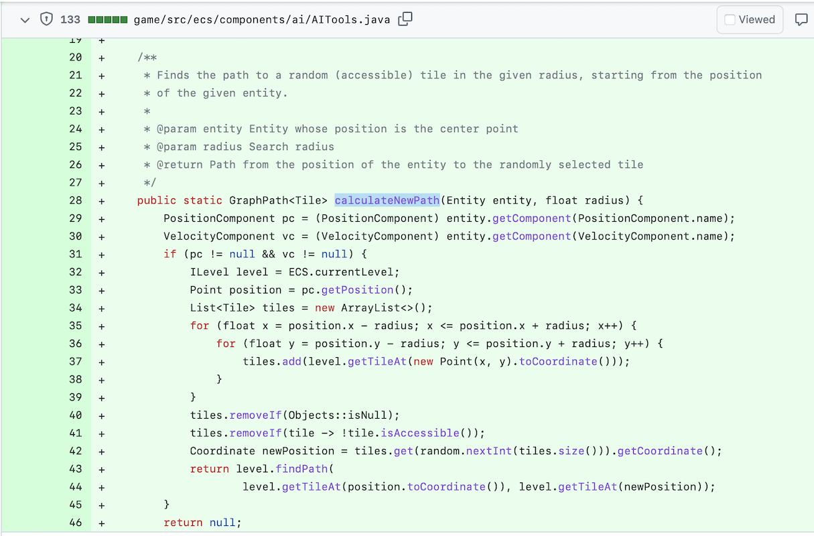

::: tldr
Häufig hat man in Methoden den Fall, dass es keinen Wert gibt, und man liefert dann `null` als "kein Wert vorhanden"
zurück. Dies führt dazu, dass die Aufrufer eine entsprechende `null`-Prüfung für die Rückgabewerte durchführen müssen,
bevor sie das Ergebnis nutzen können.

`Optional` schließt elegant den Fall "kein Wert vorhanden" ein: Es kann mit der Methode `Optional.ofNullable()` das
Argument in ein Optional verpacken (Argument != `null`) oder ein `Optional.empty()` zurückliefern ("leeres" Optional,
wenn Argument == `null`).

Man kann Optionals prüfen mit `isEmpty()` und `ifPresent()` und dann direkt mit `ifPresent()`, `orElse()` und
`orElseThrow()` auf den verpackten Wert zugreifen. Besser ist aber der Zugriff über die Stream-API von `Optional`:
`map()`, `filter`, `flatMap()`, ...

`Optional` ist vor allem für Rückgabewerte gedacht, die den Fall "kein Wert vorhanden" einschließen sollen. Attribute,
Parameter und Sammlungen sollten nicht `Optional`-Referenzen speichern, sondern "richtige" (unverpackte) Werte (und eben
zur Not `null`). `Optional` ist kein Ersatz für `null`-Prüfung von Methoden-Parametern (nutzen Sie hier beispielsweise
passende Annotationen). `Optional` ist auch kein Ersatz für vernünftiges Exception-Handling im Fall, dass etwas
Unerwartetes passiert ist. Liefern Sie **niemals** `null` zurück, wenn der Rückgabetyp der Methode ein `Optional` ist!
:::

::: youtube
-   [VL Optional](https://youtu.be/JDG_hUSBfSA)
-   [Demo Optional](https://youtu.be/vL2c0iB4uSk)
-   [Demo Optional: Beispiel aus der Praxis im PM-Dungeon](https://youtu.be/vyN-vOV9_CU)
:::

# Motivation

``` java
public class LSF {
    private Set<Studi> sl;

    public Studi getBestStudi() {
        if (sl == null) return null;  // Fehler: Es gibt noch keine Sammlung

        Studi best = null;
        for (Studi s : sl) {
            if (best == null) best = s;
            if (best.credits() < s.credits()) best = s;
        }
        return best;
    }
}

public static void main(String... args) {
    LSF lsf = new LSF();

    Studi best = lsf.getBestStudi();
    if (best != null) {
        String name = best.name();
        if (name != null) {
            // mach was mit dem Namen ...
        }
    }
}
```

::: notes
## Problem: `null` wird an (zu) vielen Stellen genutzt

-   Es gibt keinen Wert ("not found")
-   Felder wurden (noch) nicht initialisiert
-   Es ist ein Problem oder etwas Unerwartetes aufgetreten

=\> Parameter und Rückgabewerte müssen stets auf `null` geprüft werden (oder Annotationen wie `@NotNull` eingesetzt
werden ...)

## Lösung

-   `Optional<T>` für Rückgabewerte, die "kein Wert vorhanden" mit einschließen (statt `null` bei Abwesenheit von
    Werten)
-   `@NotNull`/`@Nullable` für Parameter einsetzen (oder separate Prüfung)
-   Exceptions werfen in Fällen, wo ein Problem aufgetreten ist

## Anmerkungen

-   Verwendung von `null` auf Attribut-Ebene (Klassen-interne Verwendung) ist okay!
-   `Optional<T>` ist **kein** Ersatz für `null`-Checks!
-   `null` ist **kein** Ersatz für vernünftiges Error-Handling! Das häufig zu beobachtende "Irgendwas Unerwartetes ist
    passiert, hier ist `null`" ist ein **Anti-Pattern**!

## Beispiel aus der Praxis im PM-Dungeon

Schauen Sie sich einmal das Review zu den `ecs.components.ai.AITools` in
https://github.com/Dungeon-CampusMinden/Dungeon/pull/128#pullrequestreview-1254025874 an.



Die Methode `AITools#calculateNewPath` soll in der Umgebung einer als Parameter übergebenen Entität nach einem Feld
(`Tile`) suchen, welches für die Entität betretbar ist und einen Pfad von der Position der Entität zu diesem Feld an den
Aufrufer zurückliefern.

Zunächst wird in der Entität nach einer `PositionComponent` und einer `VelocityComponent` gesucht. Wenn es (eine)
diese(r) Components nicht in der Entität gibt, wird der Wert `null` an den Aufrufer von `AITools#calculateNewPath`
zurückgeliefert. (*Anmerkung*: Interessanterweise wird in der Methode nicht mit der `VelocityComponent` gearbeitet.)

Dann wird in der `PositionComponent` die Position der Entität im aktuellen Level abgerufen. In einer Schleife werden
alle Felder im gegebenen Radius in eine Liste gespeichert. (*Anmerkung*: Da dies über die `float`-Werte passiert und
nicht über die Feld-Indizes wird ein `Tile` u.U. recht oft in der Liste abgelegt. Können Sie sich hier einfache
Verbesserungen überlegen?)

Da `level.getTileAt()` offenbar als Antwort auch `null` zurückliefern kann, werden nun zunächst per
`tiles.removeIf(Objects::isNull);` all diese `null`-Werte wieder aus der Liste entfernt. Danach erfolgt die Prüfung, ob
die verbleibenden Felder betretbar sind und nicht-betretbare Felder werden entfernt.

Aus den verbleibenden (betretbaren) Feldern in der Liste wird nun eines zufällig ausgewählt und per `level.findPath()`
ein Pfad von der Position der Entität zu diesem Feld berechnet und zurückgeliefert. (*Anmerkung*: Hier wird ein
zufälliges Tile in der Liste der umgebenden Felder gewählt, von diesem die Koordinaten bestimmt, und dann noch einmal
aus dem Level das dazugehörige Feld geholt - dabei hatte man die Referenz auf das Feld bereits in der Liste. Können Sie
sich hier eine einfache Verbesserung überlegen?)

Zusammengefasst:

-   Die als Parameter `entity` übergebene Referenz darf offenbar *nicht* `null` sein. Die ersten beiden Statements in
    der Methode rufen auf dieser Referenz Methoden auf, was bei einer `null`-Referenz zu einer `NullPointer`-Exception
    führen würde. Hier wäre `null` ein Fehlerzustand.
-   `entity.getComponent()` kann offenbar `null` zurückliefern, wenn die gesuchte Component nicht vorhanden ist. Hier
    wird `null` als "kein Wert vorhanden" genutzt, was dann nachfolgende `null`-Checks notwendig macht.
-   Wenn es die gewünschten Components nicht gibt, wird dem Aufrufer der Methode `null` zurückgeliefert. Hier ist nicht
    ganz klar, ob das einfach nur "kein Wert vorhanden" ist oder eigentlich ein Fehlerzustand?
-   `level.getTileAt()` kann offenbar `null` zurückliefern, wenn kein Feld an der Position vorhanden ist. Hier wird
    `null` wieder als "kein Wert vorhanden" genutzt, was dann nachfolgende `null`-Checks notwendig macht (Entfernen
    aller `null`-Referenzen aus der Liste).
-   `level.findPath()` kann auch wieder `null` zurückliefern, wenn kein Pfad berechnet werden konnte. Hier ist wieder
    nicht ganz klar, ob das einfach nur "kein Wert vorhanden" ist oder eigentlich ein Fehlerzustand? Man könnte
    beispielsweise in diesem Fall ein anderes Feld probieren?

Der Aufrufer bekommt also eine `NullPointer`-Exception, wenn der übergebene Parameter `entity` nicht vorhanden ist oder
den Wert `null`, wenn in der Methode etwas schief lief oder schlicht kein Pfad berechnet werden konnte oder tatsächlich
einen Pfad. Damit wird der Aufrufer gezwungen, den Rückgabewert vor der Verwendung zu untersuchen.

**Allein in dieser einen kurzen Methode macht `null` so viele extra Prüfungen notwendig und den Code dadurch schwerer
lesbar und fehleranfälliger! `null` wird als (unvollständige) Initialisierung und als Rückgabewert und für den
Fehlerfall genutzt, zusätzlich ist die Semantik von `null` nicht immer klar.** (*Anmerkung*: Der Gebrauch von `null` hat
nicht wirklich etwas mit "der Natur eines ECS" zu tun. Die Methode wurde mittlerweile komplett überarbeitet und ist in
der hier gezeigten Form glücklicherweise nicht mehr zu finden.)

Entsprechend hat sich in diesem
[Review](https://github.com/Dungeon-CampusMinden/Dungeon/pull/128#pullrequestreview-1254025874) die nachfolgende
Diskussion ergeben:


:::

# Erzeugen von *Optional*-Objekten

Konstruktor ist `private` ...

-   "Kein Wert": `Optional.empty()`
-   Verpacken eines non-`null` Elements: `Optional.of()` `\newline`{=tex} (`NullPointerException` wenn Argument `null`!)

\bigskip

-   Verpacken eines "unsicheren"/beliebigen Elements: `Optional.ofNullable()`
    -   Liefert verpacktes Element, oder
    -   `Optional.empty()`, falls Element `null` war

::: notes
Es sollte in der Praxis eigentlich nur wenige Fälle geben, wo ein Aufruf von `Optional.of()` sinnvoll ist. Ebenso ist
`Optional.empty()` nur selten sinnvoll.

Stattdessen sollte stets `Optional.ofNullable()` verwendet werden.
:::

\vfill

**`null` kann nicht nicht in `Optional<T>` verpackt werden!** [(Das wäre dann eben `Optional.empty()`.)]{.notes}

# LSF liefert jetzt *Optional* zurück

``` java
public class LSF {
    private Set<Studi> sl;

    public Optional<Studi> getBestStudi() throws NullPointerException {
        // Fehler: Es gibt noch keine Sammlung
        if (sl == null) throw new NullPointerException("There ain't any collection");

        Studi best = null;
        for (Studi s : sl) {
            if (best == null) best = s;
            if (best.credits() < s.credits()) best = s;
        }

        // Entweder Optional.empty() (wenn best==null) oder Optional.of(best) sonst
        return Optional.ofNullable(best);
    }
}
```

::: notes
Das Beispiel soll verdeutlichen, dass man im Fehlerfall nicht einfach `null` oder `Optional.empty()` zurückliefern soll,
sondern eine passende Exception werfen soll.

Wenn die Liste aber leer ist, stellt dies keinen Fehler dar! Es handelt sich um den Fall "kein Wert vorhanden". In
diesem Fall wird statt `null` nun ein `Optional.empty()` zurückgeliefert, also ein Objekt, auf dem der Aufrufer die
üblichen Methoden aufrufen kann.
:::

# Zugriff auf *Optional*-Objekte

::: notes
In der funktionalen Programmierung gibt es schon lange das Konzept von `Optional`, in Haskell ist dies beispielsweise
die Monade `Maybe`. Allerdings ist die Einbettung in die Sprache von vornherein mit berücksichtigt worden, insbesondere
kann man hier sehr gut mit *Pattern Matching* in der Funktionsdefinition auf den verpackten Inhalt reagieren.

In Java gibt es die Methode `Optional#isEmpty()`, die einen Boolean zurückliefert und prüft, ob es sich um ein leeres
`Optional` handelt oder ob hier ein Wert "verpackt" ist.

Für den direkten Zugriff auf die Werte gibt es die Methoden `Optional#orElseThrow()` und `Optional#orElse()`. Damit kann
man auf den verpackten Wert zugreifen, oder es wird eine Exception geworfen bzw. ein Ersatzwert geliefert.

Zusätzlich gibt es `Optional#isPresent()`, die als Parameter ein `java.util.function.Consumer` erwartet, also ein
funktionales Interface mit einer Methode `void accept(T)`, die das Objekt verarbeitet.
:::

``` java
Studi best;

// Testen und dann verwenden
if (!lsf.getBestStudi().isEmpty()) {
    best = lsf.getBestStudi().get();
    // mach was mit dem Studi ...
}

// Arbeite mit Consumer
lsf.getBestStudi().ifPresent(studi -> {
    // mach was mit dem Studi ...
});

// Studi oder Alternative (wenn Optional.empty())
best = lsf.getBestStudi().orElse(anne);

// Studi oder NoSuchElementException (wenn Optional.empty())
best = lsf.getBestStudi().orElseThrow();
```

::: notes
Es gibt noch eine Methode `get()`, die so verhält wie `orElseThrow()`. Da man diese Methode vom Namen her schnell mit
einem Getter verwechselt, ist sie mittlerweile *deprecated*.

*Anmerkung*: Da `getBestStudi()` eine `NullPointerException` werfen kann, sollte der Aufruf möglicherweise in ein
`try/catch` verpackt werden. Dito für `orElseThrow()`.

[Beispiel: optional.traditional.Demo]{.ex
href="https://github.com/Programmiermethoden-CampusMinden/PM-Lecture/blob/master/markdown/modern-java/src/optional/traditional/Demo.java"}
:::

# Einsatz mit Stream-API

``` java
public class LSF {
    ...
    public Optional<Studi> getBestStudi() throws NullPointerException {
        if (sl == null) throw new NullPointerException("There ain't any collection");
        return sl.stream()
                 .sorted((s1, s2) -> s2.credits() - s1.credits())
                 .findFirst();
    }
}


public static void main(String... args) {
    ...
    String name = lsf.getBestStudi()
                     .map(Studi::name)
                     .orElseThrow();
}
```

::: notes
[Beispiel: optional.streams.Demo]{.ex
href="https://github.com/Programmiermethoden-CampusMinden/PM-Lecture/blob/master/markdown/modern-java/src/optional/streams/Demo.java"}

Im Beispiel wird in `getBestStudi()` die Sammlung als Stream betrachtet, über die Methode `sorted()` und den
Lamda-Ausdruck für den `Comparator` sortiert ("falsch" herum: absteigend in den Credits der Studis in der Sammlung), und
`findFirst()` ist die terminale Operation auf dem Stream, die ein `Optional<Studi>` zurückliefert: entweder den Studi
mit den meisten Credits (verpackt in `Optional<Studi>`) oder `Optional.empty()`, wenn es überhaupt keine Studis in der
Sammlung gab.

In `main()` wird dieses `Optional<Studi>` mit den Stream-Methoden von `Optional<T>` bearbeitet, zunächst mit
`Optional#map()`. Man braucht nicht selbst prüfen, ob das von `getBestStudi()` erhaltene Objekt leer ist oder nicht, da
dies von `Optional#map()` erledigt wird: Es wendet die Methodenreferenz auf den verpackten Wert an (sofern dieser
vorhanden ist) und liefert damit den Namen des Studis als `Optional<String>` verpackt zurück. Wenn es keinen Wert, also
nur `Optional.empty()` von `getBestStudi()` gab, dann ist der Rückgabewert von `Optional#map()` ein `Optional.empty()`.
Wenn der Name, also der Rückgabewert von `Studi::name`, `null` war, dann wird ebenfalls ein `Optional.empty()`
zurückgeliefert. Dadurch wirft `orElseThrow()` dann eine `NoSuchElementException`. Man kann also direkt mit dem String
`name` weiterarbeiten ohne extra `null`-Prüfung - allerdings will man noch ein Exception-Handling einbauen (dies fehlt
im obigen Beispiel aus Gründen der Übersicht) ...
:::

::: notes
# Weitere *Optionals*

Für die drei primitiven Datentypen `int`, `long` und `double` gibt es passende Wrapper-Klassen von `Optional<T>`:
`OptionalInt`, `OptionalLong` und `OptionalDouble`.

Diese verhalten sich analog zu `Optional<T>`, haben aber keine Methode `ofNullable()`, da dies hier keinen Sinn ergeben
würde: Die drei primitiven Datentypen repräsentieren Werte - diese können nicht `null` sein.
:::

# Regeln für *Optional*

1.  Nutze `Optional` nur als Rückgabe für "kein Wert vorhanden"

    ::: notes
    `Optional` ist nicht als Ersatz für eine `null`-Prüfung o.ä. gedacht, sondern als Repräsentation, um auch ein "kein
    Wert vorhanden" zurückliefern zu können.
    :::

\bigskip

2.  Nutze nie `null` für eine `Optional`-Variable oder einen `Optional`-Rückgabewert

    ::: notes
    Wenn man ein `Optional` als Rückgabe bekommt, sollte das niemals selbst eine `null`-Referenz sein. Das macht das
    gesamte Konzept kaputt!

    Nutzen Sie stattdessen `Optional.empty()`.
    :::

3.  Nutze `Optional.ofNullable()` zum Erzeugen eines `Optional`

    ::: notes
    Diese Methode verhält sich "freundlich" und erzeugt automatisch ein `Optional.empty()`, wenn das Argument `null`
    ist. Es gibt also keinen Grund, dies mit einer Fallunterscheidung selbst erledigen zu wollen.

    Bevorzugen Sie `Optional.ofNullable()` vor einer manuellen Fallunterscheidung und dem entsprechenden Einsatz von
    `Optional.of()` und `Optional.empty()`.
    :::

4.  Erzeuge keine `Optional` als Ersatz für die Prüfung auf `null`

    ::: notes
    Wenn Sie auf `null` prüfen müssen, müssen Sie auf `null` prüfen. Der ersatzweise Einsatz von `Optional` macht es nur
    komplexer - prüfen müssen Sie hinterher ja immer noch.
    :::

5.  Nutze `Optional` nicht in Attributen, Methoden-Parametern und Sammlungen

    ::: notes
    Nutzen Sie `Optional` vor allem für Rückgabewerte.

    Attribute sollten immer direkt einen Wert haben oder `null`, analog Parameter von Methoden o.ä. ... Hier hilft
    `Optional` nicht, Sie müssten ja trotzdem eine `null`-Prüfung machen, nur eben dann über den `Optional`, wodurch
    dies komplexer und schlechter lesbar wird.

    Aus einem ähnlichen Grund sollten Sie auch in Sammlungen keine `Optional` speichern!
    :::

6.  Vermeide den direkten Zugriff (`ifPresent()`, `orElseThrow()` ...)

    ::: notes
    Der direkte Zugriff auf ein `Optional` entspricht dem Prüfen auf `null` und dann dem Auspacken. Dies ist nicht nur
    Overhead, sondern auch schlechter lesbar.

    Vermeiden Sie den direkten Zugriff und nutzen Sie `Optional` mit den Stream-Methoden. So ist dies von den Designern
    gedacht.
    :::

::: notes
# Interessante Links

-   ["Using Optionals"](https://dev.java/learn/api/streams/optionals/)
-   ["What You Might Not Know About
    Optional"](https://medium.com/javarevisited/what-you-might-not-know-about-optional-7238e3c05f63)
-   ["Experienced Developers Use These 7 Java Optional Tips to Remove Code
    Clutter"](https://medium.com/javarevisited/experienced-developers-use-these-7-java-optional-tips-to-remove-code-clutter-6e8b1a639861)
-   ["Code Smells: Null"](https://blog.jetbrains.com/idea/2017/08/code-smells-null/)
-   ["Class Optional"](https://docs.oracle.com/en/java/javase/17/docs/api/java.base/java/util/Optional.html)
:::

# Wrap-Up

`Optional` als Rückgabe für "kein Wert vorhanden"

\bigskip

-   `Optional.ofNullable()`: Erzeugen eines `Optional`
    -   Entweder Objekt "verpackt" (Argument != `null`)
    -   Oder `Optional.empty()` (Argument == `null`)
-   Prüfen mit `isEmpty()` und `ifPresent()`
-   Direkter Zugriff mit `ifPresent()`, `orElse()` und `orElseThrow()`
-   Stream-API: `map()`, `filter()`, `flatMap()`, ...

\bigskip

-   Attribute, Parameter und Sammlungen: nicht `Optional` nutzen
-   Kein Ersatz für `null`-Prüfung!

::: notes
Schöne Doku: ["Using Optionals"](https://dev.java/learn/api/streams/optionals/).
:::

::: readings
-   @LernJava
-   @Ullenboom2021 [Kap. 12.6]
:::

::: outcomes
-   k2: Optionals sind kein Ersatz für null-Prüfung!
-   k2: Optionals sollen nicht für Attribute oder Parameter genutzt werden
-   k2: Es darf kein null zurückgeliefert werden, wenn der Rückgabetyp ein Optional ist
-   k2: Optionals und null sind kein Ersatz für Exception-Handling
-   k3: Einsatz von Optional in Rückgabewerten
-   k3: Erzeugen von Optionals mit Optional.ofNullable()
-   k3: Zugriff auf Optionals entweder direkt oder per Stream-API
:::

::: quizzes
-   [Quiz Optional (ILIAS)](https://www.hsbi.de/elearning/goto.php?target=tst_1106526&client_id=FH-Bielefeld)
:::

::: challenges
**Katzen-Café**

In den
[Vorgaben](https://github.com/Programmiermethoden-CampusMinden/PM-Lecture/tree/master/markdown/modern-java/src/challenges/optional)
finden Sie eine Implementierung für ein Katzencafé.

Verändern Sie die Vorgaben so, dass möglich wenig `null` verwendet wird. Setzen Sie dazu gezielt und sinnvoll
Exception-Handling und `Optional<T>` ein. Ergänzen Sie die Vorgaben um ein ausführliches Beispiel und bevölkern Sie das
Café mit verschiedenen Katzen und geben Sie diese mit Hilfe der verschiedenen Methoden aus.

Begründen Sie die Relevanz der verbleibenden `null`-Vorkommen im Code.

**String-Handling**

Können Sie den folgenden Code so umschreiben, dass Sie statt der `if`-Abfragen und der einzelnen direkten
Methodenaufrufe die Stream-API und `Optional<T>` nutzen?

``` java
String format(final String text, String replacement) {
    if (text.isEmpty()) {
        return "";
    }

    final String trimmed = text.trim();
    final String withSpacesReplaced = trimmed.replaceAll(" +", replacement);

    return replacement + withSpacesReplaced + replacement;
}
```

Ein Aufruf `format(" Hello World ... ", "_");` liefert den String "`_Hello_World_..._`".

<!-- Notes
```java
String formatFP(final String text, String replacement) {
    final Predicate<String> isNotEmpty = s -> !s.isEmpty();
    final Function<String, String> replaceSpaces = s -> s.replaceAll(" +", replacement);
    final Function<String, String> appendReplacement = s -> String.format("%s%s%s", replacement, s, replacement);

    return Optional.ofNullable(text)
            .filter(isNotEmpty)
            .map(String::trim)
            .map(replaceSpaces)
            .map(appendReplacement)
            .orElse("");
}
```
-->
:::
