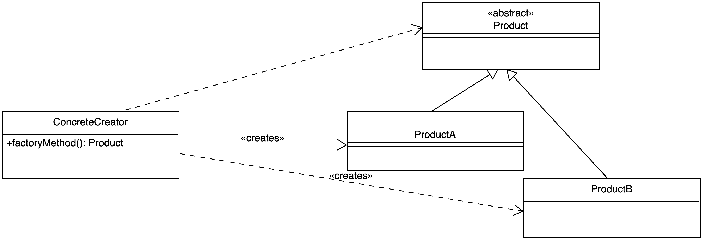

# Factory-Method-Pattern

> [!IMPORTANT]
>
> <details open>
>
> <summary><strong>🎯 TL;DR</strong></summary>
>
> Oft ist es wünschenswert, dass Nutzer nicht direkt Objekte von
> bestimmten Klassen anlegen (können). Hier kann eine “Fabrik-Methode”
> (**Factory-Method**) helfen, der man die gewünschten Parameter
> übergibt und die daraus dann das passende Objekt (der richtigen
> Klasse) erzeugt und zurückliefert.
>
> Dadurch erreicht man eine höhere Entkoppelung, die Nutzer müssen nur
> noch das Interface oder die abstrakte Klasse, also den Obertyp des
> Ergebnisses kennen. Außerdem lassen sich so leicht die konkreten
> Klassen austauschen.
>
> Dieses Entwurfsmuster kommt häufig zusammen mit dem
> *Singleton-Pattern* vor, wo es nur eine einzige Instanz einer Klasse
> geben soll. Über eine Fabrik-Methode kann man diese Instanz ggf.
> erzeugen und dann die Referenz darauf zurückliefern.
> </details>

> [!TIP]
>
> <details open>
>
> <summary><strong>🎦 Videos</strong></summary>
>
> - [VL Factory-Method-Pattern](https://youtu.be/mJWe-2BS2W0)
> - [Demo Factory-Method-Pattern](https://youtu.be/14rt1YIoiME)
>
> </details>

## Motivation: Ticket-App

- Nutzer geben Fahrtziel an (und nicht die Ticketart!)

<!-- -->

- Ticket-App bucht passendes Ticket
  - User muss nicht die konkreten Ticketarten kennen
  - Ticketarten lassen sich leicht austauschen

=\> **Factory-Method-Pattern**: Objekte sollen nicht direkt durch den
Nutzer erzeugt werden

## Factory-Method-Pattern

<picture><source media="(prefers-color-scheme: light)" srcset="images/factorymethod_light.png"><source media="(prefers-color-scheme: dark)" srcset="images/factorymethod_dark.png"></picture>

## Hands-On: Ticket-App

Implementieren Sie eine Ticket-App, die verschiedene Tickets mit Hilfe
des Factory-Method Entwurfsmusters generiert.

<p align="right"><a href="https://github.com/Programmiermethoden-CampusMinden/PM-Lecture/blob/master/markdown/pattern/src/factory/FactoryBeispiel.java">UML; Konsole: factory.FactoryBeispiel</a></p>

## Wrap-Up

- Konkrete Objekte sollen nicht direkt über Konstruktor erzeugt werden
- (Statische) Hilfsmethode, die aus Parameter das “richtige” Objekte
  erzeugt

<!-- -->

- Vorteil:
  - Nutzer kennt nur das Interface
  - Konkrete Klassen lassen sich leicht austauschen

## 📖 Zum Nachlesen

- Eilebrecht und Starke ([2013](#ref-Eilebrecht2013))
- Gamma u. a. ([2011](#ref-Gamma2011))
- Kleuker ([2018](#ref-Kleuker2018))

> [!NOTE]
>
> <details>
>
> <summary><strong>✅ Lernziele</strong></summary>
>
> - k3: Entwurfsmuster Factory-Methode anwenden
>
> </details>

> [!TIP]
>
> <details>
>
> <summary><strong>🧩 Quizzes</strong></summary>
>
> - [Quiz Factory-Method-Pattern
>   (ILIAS)](https://www.hsbi.de/elearning/goto.php?target=tst_1106533&client_id=FH-Bielefeld)
>
> </details>

> [!TIP]
>
> <details>
>
> <summary><strong>🏅 Challenges</strong></summary>
>
> Ein Kunde kommt in unser Computergeschäft und möchte bei uns einen
> Computer bestellen. Dabei gibt er an, wie er diesen vorwiegend nutzen
> möchte bzw. für welchen Zweck er gedacht ist (“*stationär*” oder
> “*mobil*”). Nach reichlicher Überlegung, ob er den neuen Rechner zu
> Hause stehen haben möchte oder lieber keinen weiteren Rechner, egal ob
> “*mobil*” oder “*stationär*”, bei sich im Weg herumstehen haben will,
> teilt er Ihnen seine Entscheidung darüber mit (“*stationär*” oder
> “*mobil*” vs. “*nicht daheim*”). Bei diesem Gespräch merkt er
> beiläufig an, dass es ein Rechner mit “*viel Wumms*” sein könnte oder
> vielleicht doch besser etwas Kleines, was leise vor sich hin schnurrt
> (“*viel Wumms*” vs. “*leise schnurrend*”).
>
> Je nach gewünschter Konfiguration soll ein den oben genannten
> Auswahlkriterien entsprechender Rechner mit den aus der unten
> stehenden Konfigurationsmatrix zu entnehmenden Eigenschaften
> automatisch erzeugt werden. Die Größe des installierten `RAM`, die
> Anzahl der eingebauten `CPU`-Kerne mit ihrer jeweiligen Taktrate,
> sowie die Art und Größe der installierten Festplatte (`HDD` oder
> `SSD`) sollte dabei zu dem gewählten Paket passend gesetzt werden.
>
> Implementieren Sie eine “Computerfabrik” (Klasse `ComputerFactory`),
> die Ihnen den richtig konfigurierten Rechner zusammenbaut. Nutzen Sie
> dabei das “Factory-Method-Pattern” zum Erzeugen der Objekte der
> einzelnen Subklassen. Dabei soll Ihre Computerfabrik anhand der ihr
> übergebenen Konfiguration eigenständig entscheiden, welche Art von
> Computer dabei erstellt werden soll.
>
> Implementieren Sie dazu in Ihrer Factory die Factory-Methode
> `buildComputer`, welche das jeweils passend konfigurierte Objekt
> zurückgibt.
>
> ``` java
> public class ComputerFactory {
>     ...
>
>     public static Computer buildComputer(..."stationär",..."viel Wumms") {
>         ...
>         return myComputer;
>     }
> }
> ```
>
> **Konfigurationsmatrix**
>
> |  | “stationär” (`DesktopComputer`) | “mobil” (`LaptopComputer`) | “nicht daheim” (`CloudComputer`) |
> |:--:|:--:|:--:|:--:|
> | “leise schnurrend” | 8 Cores, 1.21GHZ, 16GB RAM, 256GB HDD | 4 Cores, 1.21GHZ, 8GB RAM, 256GB HDD | 8 Cores, 1.21GHZ, 24GB RAM, 1000GB HDD |
> | “viel Wumms” | 16 Cores, 4.2GHZ, 32GB RAM, 2000GB SSD | 8 Cores, 2.4GHZ, 16GB RAM, 256GB SSD | 42 Cores, 9.001GHZ, 128GB RAM, 10000GB SSD |
>
> </details>

------------------------------------------------------------------------

> [!NOTE]
>
> <details>
>
> <summary><strong>👀 Quellen</strong></summary>
>
> <div id="refs" class="references csl-bib-body hanging-indent">
>
> <div id="ref-Eilebrecht2013" class="csl-entry">
>
> Eilebrecht, K., und G. Starke. 2013. *Patterns kompakt*. Springer.
>
> </div>
>
> <div id="ref-Gamma2011" class="csl-entry">
>
> Gamma, E., R. Helm, R. E. Johnson, und J. Vlissides. 2011. *Design
> Patterns*. Addison-Wesley.
>
> </div>
>
> <div id="ref-Kleuker2018" class="csl-entry">
>
> Kleuker, S. 2018. *Grundkurs Software-Engineering mit UML*. Springer
> Vieweg. <https://doi.org/10.1007/978-3-658-19969-2>.
>
> </div>
>
> </div>
>
> </details>

------------------------------------------------------------------------


Unless otherwise noted, this work is licensed under CC BY-SA 4.0.

<blockquote><p><sup><sub><strong>Last modified:</strong> 02b1db8 (markdown: reformat (#32), 2025-08-10)<br></sub></sup></p></blockquote>
