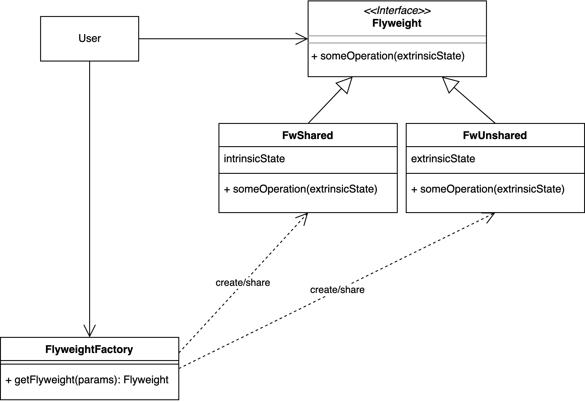
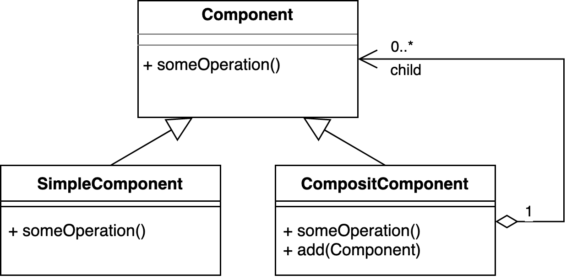

# Flyweight-Pattern

> [!IMPORTANT]
>
> <details open>
>
> <summary><strong>🎯 TL;DR</strong></summary>
>
> Das Flyweight-Pattern dient der Steigerung der (Speicher-) Effizienz,
> indem gemeinsame Daten durch gemeinsam genutzte Objekte repräsentiert
> werden.
>
> Den sogenannten *Intrinsic State*, also die Eigenschaften, die sich
> alle Objekte teilen, werden in gemeinsam genutzte Objekte ausgelagert,
> und diese werden in den ursprünglichen Klassen bzw. Objekten nur
> referenziert. So werden diese Eigenschaften nur einmal in den Speicher
> geladen.
>
> Den sogenannten *Extrinsic State*, also alle individuellen
> Eigenschaften, werden entsprechend individuell je Objekt
> modelliert/eingestellt.
> </details>

> [!TIP]
>
> <details open>
>
> <summary><strong>🎦 Videos</strong></summary>
>
> - [VL Flyweight-Pattern](https://youtu.be/Oo8TO8z5wQI)
>
> </details>

## Motivation: Modellierung eines Levels

### Variante I: Einsatz eines Enums für die Felder

``` java
public enum Tile { WATER, FLOOR, WALL, ... }

public class Level {
    private Tile[][] tiles;

    public Level() {
        tiles[0][0] = Tile.WALL;  tiles[1][0] = Tile.WALL;   tiles[2][0] = Tile.WALL;  ...
        tiles[0][1] = Tile.WALL;  tiles[1][1] = Tile.FLOOR;  tiles[2][1] = Tile.FLOOR; ...
        tiles[0][2] = Tile.WALL;  tiles[1][2] = Tile.WATER;  tiles[2][2] = Tile.FLOOR; ...
        ...
    }

    public boolean isAccessible(int x, int y) {
        switch (tiles[x][y]) {
            case: WATER: return false;
            case: FLOOR: return true;
            ...
        }
    }
    ...
}
```

Ein Level kann als Array mit Feldern modelliert werden. Die Felder
selbst könnten mit Hilfe eines Enums repräsentiert werden.

Allerdings muss dann bei jedem Zugriff auf ein Feld und dessen
Eigenschaften eine entsprechende `switch/case`-Fallunterscheidung
eingebaut werden. Damit verstreut man die Eigenschaften über die gesamte
Klasse, und bei jeder Änderung am Enum für die Tiles müssen *alle*
`switch/case`-Blöcke entsprechend angepasst werden.

### Variante II: Einsatz einer Klasse/Klassenhierarchie für die Felder

``` java
public abstract class Tile {
    protected boolean isAccessible;
    protected Texture texture;
    public boolean isAccessible() { return isAccessible; }
}
public class Floor extends Tile {
    public Floor() { isAccessible = true;  texture = Texture.loadTexture("path/to/floor.png"); }
}
...

public class Level {
    private final Tile[][] tiles;

    public Level() {
        tiles[0][0] = new Wall();  tiles[1][0] = new Wall();   tiles[2][0] = new Wall();  ...
        tiles[0][1] = new Wall();  tiles[1][1] = new Floor();  tiles[2][1] = new Floor(); ...
        tiles[0][2] = new Wall();  tiles[1][2] = new Water();  tiles[2][2] = new Floor(); ...
        ...
    }
    public boolean isAccessible(int x, int y) { return tiles[x][y].isAccessible(); }
}
```

Hier werden die Felder über eine Klassenhierarchie mit gemeinsamer
Basisklasse modelliert.

Allerdings wird hier die Klassenhierarchie unter Umständen sehr schnell
sehr umfangreich. Außerdem werden Eigenschaften wie Texturen beim
Anlegen der Tile-Objekte immer wieder neu geladen und entsprechend
mehrfach im Speicher gehalten (großer Speicherbedarf).

## Flyweight: Nutze gemeinsame Eigenschaften gemeinsam

Idee: Eigenschaften, die nicht an einem konkreten Objekt hängen, werden
in gemeinsam genutzte Objekte ausgelagert (Shared Objects/Memory).

Ziel: Erhöhung der Speichereffizienz (geringerer Bedarf an
Hauptspeicher, geringere Bandbreite bei der Übertragung der Daten/Objekt
an die GPU, …).

### Lösungsvorschlag I

``` java
public final class Tile {
    private final boolean isAccessible;
    private final Texture texture;
    public boolean isAccessible() { return isAccessible; }
}

public class Level {
    private static final Tile FLOOR = new Tile(true,  Texture.loadTexture("path/to/floor.png"));
    private static final Tile WALL  = new Tile(false, Texture.loadTexture("path/to/wall.png"));
    private static final Tile WATER = new Tile(false, Texture.loadTexture("path/to/water.png"));

    private final Tile[][] tiles;

    public Level() {
        tiles[0][0] = WALL;  tiles[1][0] = WALL;   tiles[2][0] = WALL;  ...
        tiles[0][1] = WALL;  tiles[1][1] = FLOOR;  tiles[2][1] = FLOOR; ...
        tiles[0][2] = WALL;  tiles[1][2] = WATER;  tiles[2][2] = FLOOR; ...
        ...
    }
    public boolean isAccessible(int x, int y) { return tiles[x][y].isAccessible(); }
}
```

Man legt die verschiedenen Tiles nur je *einmal* an und nutzt dann
Referenzen auf diese Objekte. Dadurch werden die speicherintensiven
Elemente wie Texturen o.ä. nur je einmal geladen und im Speicher
vorgehalten.

Bei dieser Modellierung können die einzelnen Felder aber keine
individuellen Eigenschaften haben, wie etwa, ob ein Feld bereits durch
den Helden untersucht/betreten wurde o.ä. …

### Lösungsvorschlag II

``` java
public final class TileModel {
    private final boolean isAccessible;
    private final Texture texture;
    public boolean isAccessible() { return isAccessible; }
}
public final class Tile {
    private boolean wasEntered;
    private final TileModel model;
    public boolean isAccessible() { return model.isAccessible(); }
    public boolean wasEntered() { return wasEntered; }
}

public class Level {
    private static final TileModel FLOOR = new TileModel(true,  Texture.loadTexture("path/to/floor.png"));
    ...

    private final Tile[][] tiles;

    public Level() {
        tiles[0][0] = new Tile(WALL);  tiles[1][0] = new Tile(WALL);   tiles[2][0] = new Tile(WALL);  ...
        tiles[0][1] = new Tile(WALL);  tiles[1][1] = new Tile(FLOOR);  tiles[2][1] = new Tile(FLOOR); ...
        tiles[0][2] = new Tile(WALL);  tiles[1][2] = new Tile(WATER);  tiles[2][2] = new Tile(FLOOR); ...
        ...
    }
    public boolean isAccessible(int x, int y) { return tiles[x][y].isAccessible(); }
}
```

In dieser Variante werden die Eigenschaften eines `Tile` in
Eigenschaften aufgeteilt, die von den Tiles geteilt werden können (im
Beispiel Textur und Betretbarkeit) und in Eigenschaften, die je Feld
individuell modelliert werden müssen (im Beispiel: wurde das Feld
bereits betreten?).

Entsprechend könnte man für das Level-Beispiel ein `TileModel` anlegen,
welches die gemeinsamen Eigenschaften verwaltet. Man erzeugt dann im
Level die nötigen Modelle je genau einmal und nutzt sie, um damit dann
die konkreten Felder zu erzeugen und im Level-Array zu referenzieren.
Damit werden Tile-Modelle von Tiles der gleichen “Klasse” gemeinsam
genutzt und die Texturen u.ä. nur je einmal im Speicher repräsentiert.

## Flyweight-Pattern: Begriffe

- **Intrinsic** State: invariant, Kontext-unabhängig, gemeinsam nutzbar
  =\> auslagern in gemeinsame Objekte

<!-- -->

- **Extrinsic** State: variant, Kontext-abhängig und kann nicht geteilt
  werden =\> individuell modellieren

## Flyweight-Pattern: Klassische Modellierung

<picture><source media="(prefers-color-scheme: light)" srcset="images/flyweight_light.png"><source media="(prefers-color-scheme: dark)" srcset="images/flyweight_dark.png"></picture>

Im klassischen Flyweight-Pattern der “Gang of Four” ([Gamma u. a.
2011](#ref-Gamma2011)) wird ein gemeinsames Interface erstellt, von dem
die einzelnen Fliegengewicht-Klassen ableiten. Der Nutzer kennt nur
dieses Interface und nicht direkt die implementierenden Klassen.

Das Interface wird von zwei Arten von Klassen implementiert: Klassen,
die nur intrinsischen Zustand modellieren, und Klassen, die
extrinsischen Zustand modellieren.

Für die Klassen, die den intrinsischen Zustand modellieren, werden die
Objekte gemeinsam genutzt (nicht im Diagramm darstellbar) und deshalb
eine Factory davor geschaltet, die die Objekte der entsprechenden
Fliegengewicht-Klassen erzeugt und dabei darauf achtet, dass diese
Objekte nur einmal angelegt und bei erneuter Anfrage einfach nur wieder
zurückgeliefert werden.

Zusätzlich gibt es Klassen, die extrinsischen Zustand modellieren und
deshalb nicht unter den Nutzern geteilt werden können und deren Objekte
bei jeder Anfrage neu erstellt werden. Aber auch diese werden von der
Factory erzeugt/verwaltet.

### Kombination mit dem Composite-Pattern

In der Praxis kann man das Pattern so direkt meist nicht einsetzen,
sondern verbindet es mit dem Composite-Pattern:

<picture><source media="(prefers-color-scheme: light)" srcset="images/composite_light.png"><source media="(prefers-color-scheme: dark)" srcset="images/composite_dark.png"></picture>

Ein Element kann eine einfache Komponente sein (im obigen Beispiel war
das die Klasse `TileModel`) oder eine zusammengesetzte Komponente, die
ihrerseits andere Komponenten speichert (im obigen Beispiel war das die
Klasse `Tile`, die ein Objekt vom Typ `TileModel` referenziert -
allerdings fehlt im obigen Beispiel das gemeinsame Interface …).

### Level-Beispiel mit Flyweight (vollständig) und Composite

Im obigen Beispiel wurde zum Flyweight-Pattern noch das
Composite-Pattern hinzugenommen, aber es wurde aus Gründen der
Übersichtlichkeit auf ein gemeinsames Interface und auf die Factory
verzichtet. Wenn man es anpassen würde, dann würde das Beispiel ungefähr
so aussehen:

``` java
public interface ITile {
    public boolean isAccessible();
}

public final class TileModel implements ITile {
    private final boolean isAccessible;
    private final Texture texture;

    public boolean isAccessible() { return isAccessible; }
}

public final class Tile implements ITile {
    private boolean wasEntered;
    private final TileModel model;

    public boolean isAccessible() { return model.isAccessible(); }

    public boolean wasEntered() { return wasEntered; }
}

public final class TileFactory {
    private static final TileModel FLOOR = new TileModel(true,  Texture.loadTexture("path/to/floor.png"));
    ...

    public static final ITile getTile(String tile) {
        switch (tile) {
            case "WALL": return new Tile(WALL);
            case "FLOOR": return new Tile(FLOOR);
            case "WATER": return new Tile(WATER);
            ...
        }
    }
}

public class Level {
    private ITile[][] tiles;

    public Level() {
        tiles[0][0] = TileFactory.getTile("WALL");
        tiles[1][0] = TileFactory.getTile("WALL");
        tiles[2][0] = TileFactory.getTile("WALL");
        ...

        tiles[0][1] = TileFactory.getTile("WALL");
        tiles[1][1] = TileFactory.getTile("FLOOR");
        tiles[2][1] = TileFactory.getTile("FLOOR");
        ...

        tiles[0][2] = TileFactory.getTile("WALL");
        tiles[1][2] = TileFactory.getTile("WATER");
        tiles[2][2] = TileFactory.getTile("FLOOR");
        ...

        ...
    }

    public boolean isAccessible(int x, int y) { return tiles[x][y].isAccessible(); }
}
```

## Verwandtschaft zum Type-Object-Pattern

Das
[Flyweight-Pattern](https://gameprogrammingpatterns.com/flyweight.html)
ist sehr ähnlich zum [Type-Object-Pattern](type-object.md). In beiden
Pattern teilen sich mehrere Objekte gemeinsame Daten, die über
Referenzen auf gemeinsame Hilfsobjekte eingebunden werden. Die
Zielrichtung unterscheidet sich aber deutlich:

- Beim Flyweight-Pattern ist das Ziel vor allem die Erhöhung der
  Speichereffizienz, und die dort geteilten Daten müssen nicht unbedingt
  den “Typ” des nutzenden Objekts definieren.
- Beim Type-Objekt-Pattern ist das Ziel die Flexibilität auf Code-Ebene,
  indem man die Anzahl der Klassen minimiert und die Typen in ein
  eigenes Objekt-Modell verschiebt. Das Teilen von Speicher ist hier nur
  ein Nebeneffekt.

## Wrap-Up

Flyweight-Pattern: Steigerung der (Speicher-) Effizienz durch gemeinsame
Nutzung von Objekten

- Lagere *Intrinsic State* in gemeinsam genutzte Objekte aus
- Modelliere *Extrinsic State* individuell

## 📖 Zum Nachlesen

- Nystrom ([2014, Kap. 3](#ref-Nystrom2014))

> [!NOTE]
>
> <details>
>
> <summary><strong>✅ Lernziele</strong></summary>
>
> - k2: Unterscheiden von Intrinsic State und Extrinsic State
> - k2: Verschieben des Intrinsic States in gemeinsam genutzte Objekte
> - k2: Erklären der Ähnlichkeit zum Type-Object-Pattern
> - k3: Praktischer Einsatz des Flyweight-Patterns
>
> </details>

> [!TIP]
>
> <details>
>
> <summary><strong>🧩 Quizzes</strong></summary>
>
> - [Quiz Flyweight-Pattern
>   (ILIAS)](https://www.hsbi.de/elearning/goto.php?target=tst_1106534&client_id=FH-Bielefeld)
>
> </details>

> [!TIP]
>
> <details>
>
> <summary><strong>🏅 Challenges</strong></summary>
>
> In den
> [Vorgaben](https://github.com/Programmiermethoden-CampusMinden/PM-Lecture/tree/master/markdown/pattern/src/challenges/flyweight)
> finden Sie ein Modellierung eines Schachspiels.
>
> Identifizieren Sie die Stellen im Vorgabe-Code, wo Sie das
> Flyweight-Pattern sinnvoll anwenden können und bauen Sie dieses
> Pattern über ein Refactoring ein. Begründen Sie, wie Sie das Pattern
> eingesetzt haben und warum Sie welche Elemente *immutable* oder
> *mutable* deklariert haben.
>
> Wieso eignet sich das Flyweight-Pattern besonders im Bereich von
> Computerspielen? Geben Sie mögliche Vor- und Nachteile an und
> begründen Sie Ihre Antwort.
> </details>

------------------------------------------------------------------------

> [!NOTE]
>
> <details>
>
> <summary><strong>👀 Quellen</strong></summary>
>
> <div id="refs" class="references csl-bib-body hanging-indent">
>
> <div id="ref-Gamma2011" class="csl-entry">
>
> Gamma, E., R. Helm, R. E. Johnson, und J. Vlissides. 2011. *Design
> Patterns*. Addison-Wesley.
>
> </div>
>
> <div id="ref-Nystrom2014" class="csl-entry">
>
> Nystrom, R. 2014. *Game Programming Patterns*. Genever Benning.
> <https://github.com/munificent/game-programming-patterns>.
>
> </div>
>
> </div>
>
> </details>

------------------------------------------------------------------------


Unless otherwise noted, this work is licensed under CC BY-SA 4.0.

<blockquote><p><sup><sub><strong>Last modified:</strong> 02b1db8 (markdown: reformat (#32), 2025-08-10)<br></sub></sup></p></blockquote>
