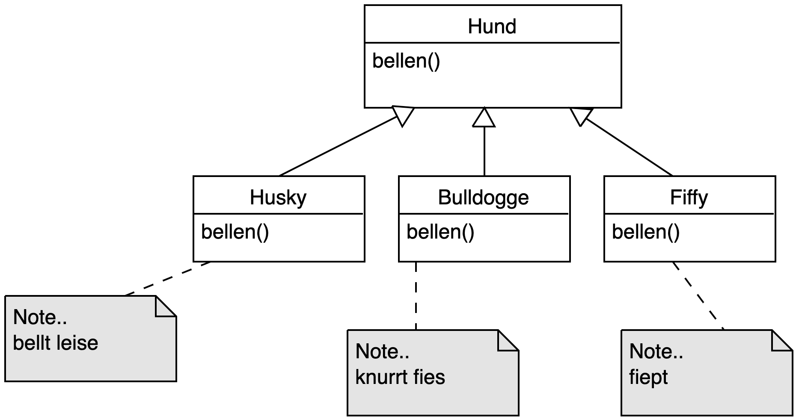
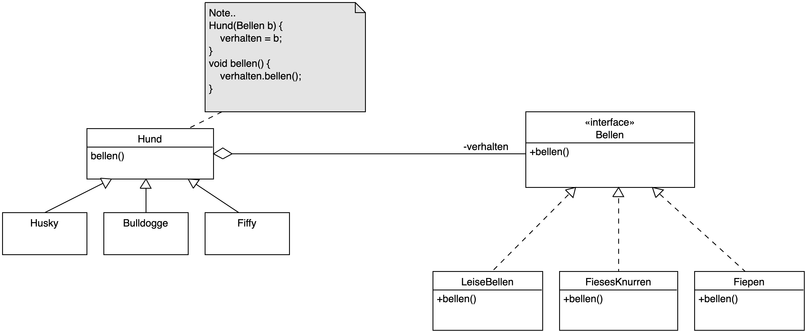
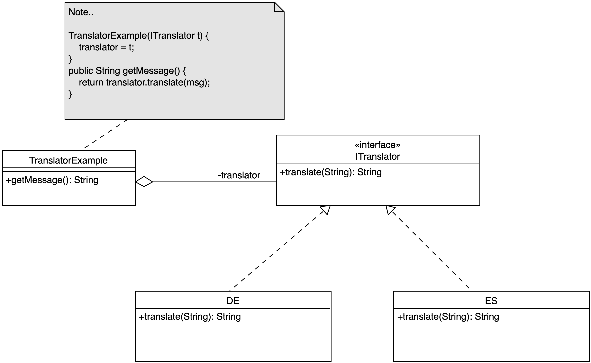

# Strategy-Pattern

> [!IMPORTANT]
>
> <details open>
>
> <summary><strong>🎯 TL;DR</strong></summary>
>
> Das Verhalten von Klassen kann über Vererbungshierarchien
> weitergegeben und durch Überschreiben in den erbenden Klassen
> verändert werden. Dies führt häufig schnell zu breiten und tiefen
> Vererbungsstrukturen.
>
> Das Strategy-Pattern ist ein Entwurfsmuster, in dem Verhalten
> stattdessen an passende Klassen/Objekte ausgelagert (delegiert) wird.
>
> Es wird eine Schnittstelle benötigt (Interface oder abstrakte Klasse),
> in dem Methoden zum Abrufen des gewünschten Verhaltens definiert
> werden. Konkrete Klassen leiten davon ab und implementieren das
> gewünschte konkrete Verhalten.
>
> In den nutzenden Klassen wird zur Laufzeit eine passende Instanz der
> (Strategie-) Klassen übergeben (Konstruktor, Setter, …) und
> beispielsweise über ein Attribut referenziert. Das gewünschte
> Verhalten muss nun nicht mehr in der nutzenden Klasse selbst
> implementiert werden, stattdessen wird einfach auf dem übergebenen
> Objekt die Methode aus der Schnittstelle aufgerufen. Dies nennt man
> auch “Delegation”, weil die Aufgabe (das Verhalten) an ein anderes
> Objekt (hier das Strategie-Objekt) weiter gereicht (delegiert) wurde.
> </details>

> [!TIP]
>
> <details open>
>
> <summary><strong>🎦 Videos</strong></summary>
>
> - [VL Strategy-Pattern](https://youtu.be/WI2riW7yOSE)
> - [Demo Strategy-Pattern](https://youtu.be/IgjlFr2ZcW4)
>
> </details>

## Wie kann man das Verhalten einer Klasse dynamisch ändern?

<picture><source media="(prefers-color-scheme: light)" srcset="images/hunde_light.png"><source media="(prefers-color-scheme: dark)" srcset="images/hunde_dark.png"></picture>

Modellierung unterschiedlicher Hunderassen: Jede Art bellt anders.

Es bietet sich an, die Hunderassen von einer gemeinsamen Basisklasse
`Hund` abzuleiten, um die Hundeartigkeit allgemein sicherzustellen.

Da jede Rasse anders bellen soll, muss jedes Mal die Methode `bellen`
überschrieben werden. Das ist relativ aufwändig und fehleranfällig.
Außerdem kann man damit nicht modellieren, dass es beispielsweise auch
konkrete Bulldoggen geben mag, die nur leise fiepen …

## Lösung: Delegation der Aufgabe an geeignetes Objekt

<picture><source media="(prefers-color-scheme: light)" srcset="images/hunde_strat_light.png"><source media="(prefers-color-scheme: dark)" srcset="images/hunde_strat_dark.png"></picture>

Der `Hund` delegiert das Verhalten beim Bellen an ein Objekt, welches
beispielsweise bei der Instantiierung der Klasse übergeben wurde (oder
später über einen Setter). D.h. die Methode `Hund#bellen` bellt nicht
mehr selbst, sondern ruft auf einem passenden Objekt eine vereinbarte
Methode auf.

Dieses passende Objekt ist hier im Beispiel vom Typ `Bellen` und hat
eine Methode `bellen` (Interface). Die verschiedenen Bell-Arten kann man
über eigene Klassen implementieren, die das Interface einhalten.

Damit braucht man in den Klassen für die Hunderassen die Methode
`bellen` nicht jeweils neu überschreiben, sondern muss nur bei der
Instantiierung eines Hundes ein passendes `Bellen`-Objekt mitgeben.

Als netten Nebeneffekt kann man so auch leicht eine konkrete Bulldogge
realisieren, die eben nicht fies knurrt, sondern leise fiept …

Entwurfsmuster: **Strategy Pattern**

## Exkurs UML: Assoziation vs. Aggregation vs. Komposition

Eine **Assoziation** beschreibt eine Beziehung zwischen zwei (oder mehr)
UML-Elementen (etwa Klassen oder Interfaces).

Eine **Aggregation** (leere Raute) ist eine Assoziation, die eine
*Teil-Ganzes-Beziehung* hervorhebt. Teile können dabei ohne das Ganze
existieren (Beispiel: Personen als Partner in einer Ehe-Beziehung). D.h.
auf der einbindenden Seite (mit der leeren Raute) hat man implizit
`0..*` stehen.

Eine **Komposition** (volle Raute) ist eine Assoziation, die eine
Teil-Ganzes-Beziehung hervorhebt. Teile können aber nicht ohne das Ganze
existieren (Beispiel: Gebäude und Stockwerke: Ein Gebäude besteht aus
Stockwerken, die ohne das Gebäude aber nicht existieren.). D.h. auf der
einbindenden Seite (mit der vollen Raute) steht implizit eine `1` (ein
Stockwerk gehört genau zu einem Gebäude, ein Gebäude besteht aber aus
mehreren Stockwerken).

Siehe auch
[Aggregation](https://de.wikipedia.org/wiki/Aggregation_(Informatik)),
[Assoziation](https://de.wikipedia.org/wiki/Assoziation_(UML)#Aggregation_und_Komposition)
und [Klassendiagramm](https://de.wikipedia.org/wiki/Klassendiagramm).

## Zweites Beispiel: Sortieren einer Liste von Studis

Sortieren einer Liste von Studis: `Collections.sort` kann eine Liste
nach einem Default-Kriterium sortieren oder aber über einen extra
`Comparator` nach benutzerdefinierten Kriterien … Das Verhalten der
Sortiermethode wird also quasi an dieses Comparator-Objekt delegiert …

``` java
public class Studi {
    private String name;
    public Studi(String name) { this.name = name; }

    public static void main(String[] args) {
        List<Studi> list = new ArrayList<Studi>();
        list.add(new Studi("Klaas"));
        list.add(new Studi("Hein"));
        list.add(new Studi("Pit"));

        // Sortieren der Liste (Standard-Reihenfolge)?!
        // Sortieren der Liste (eigene Reihenfolge)?!
    }
}
```

<p align="right"><a href="https://github.com/Programmiermethoden-CampusMinden/PM-Lecture/tree/master/markdown/pattern/src/strategy/">Konsole strategy.SortDefault, strategy.SortOwnCrit</a></p>

*Anmerkung*: Die Interfaces `Comparable` und `Comparator` und deren
Nutzung wurde(n) in OOP besprochen. Anonyme Klassen wurden ebenfalls in
OOP besprochen. Bitte lesen Sie dies noch einmal in der
Semesterliteratur nach, wenn Sie hier unsicher sind!

## Hands-On: Strategie-Muster

Implementieren Sie das Strategie-Muster für eine Übersetzungsfunktion:

- Eine Klasse liefert eine Nachricht (`String`) mit `getMessage()`
  zurück.
- Diese Nachricht ist in der Klasse in Englisch implementiert.
- Ein passendes Übersetzerobjekt soll die Nachricht beim Aufruf der
  Methode `getMessage()` in die Ziel-Sprache übersetzen.

Fragen:

1.  Wie muss das Pattern angepasst werden?
2.  Wie sieht die Implementierung aus?

## Auflösung

<picture><source media="(prefers-color-scheme: light)" srcset="images/translator_light.png"><source media="(prefers-color-scheme: dark)" srcset="images/translator_dark.png"></picture>

<p align="right"><a href="https://github.com/Programmiermethoden-CampusMinden/PM-Lecture/blob/master/markdown/pattern/src/strategy/TranslatorExample.java">Konsole strategy.TranslatorExample</a></p>

## Wrap-Up

Strategy-Pattern: Verhaltensänderung durch Delegation an passendes
Objekt

- Interface oder abstrakte Klasse als Schnittstelle
- Konkrete Klassen implementieren Schnittstelle =\> konkrete Strategien
- Zur Laufzeit Instanz dieser Klassen übergeben (Aggregation) …
- … und nutzen (Delegation)

## 📖 Zum Nachlesen

- Eilebrecht und Starke ([2013](#ref-Eilebrecht2013))
- Gamma u. a. ([2011](#ref-Gamma2011))
- Kleuker ([2018](#ref-Kleuker2018))

> [!NOTE]
>
> <details>
>
> <summary><strong>✅ Lernziele</strong></summary>
>
> - k3: Strategie-Entwurfsmuster praktisch anwenden
>
> </details>

> [!TIP]
>
> <details>
>
> <summary><strong>🧩 Quizzes</strong></summary>
>
> - [Quiz Strategy-Pattern
>   (ILIAS)](https://www.hsbi.de/elearning/goto.php?target=tst_1106537&client_id=FH-Bielefeld)
>
> </details>

> [!TIP]
>
> <details>
>
> <summary><strong>🏅 Challenges</strong></summary>
>
> Implementieren Sie das Spiel “Schere,Stein,Papier” (Spielregeln
> vergleiche
> [wikipedia.org/wiki/Schere,Stein,Papier](https://de.wikipedia.org/wiki/Schere,_Stein,_Papier))
> in Java.
>
> Nutzen Sie das Strategy-Pattern, um den Spielerinstanzen zur Laufzeit
> eine konkrete Spielstrategie mitzugeben, nach denen die Spieler ihre
> Züge *berechnen*. Implementieren Sie mindestens drei unterschiedliche
> konkrete Strategien.
>
> *Hinweis*: Eine mögliche Strategie könnte sein, den Nutzer via
> Tastatureingabe nach dem nächsten Zug zu fragen.
>
> **Gehen Sie bei der Lösung der Aufgabe methodisch vor**:
>
> 1.  Stellen Sie sich eine Liste mit relevanten Anforderungen zusammen.
> 2.  Erstellen Sie (von Hand) ein Modell (UML-Klassendiagramm):
>     - Welche Klassen und Interfaces werden benötigt?
>     - Welche Aufgaben sollen die Klassen haben?
>     - Welche Attribute und Methoden sind nötig?
>     - Wie sollen die Klassen interagieren, wer hängt von wem ab?
> 3.  Implementieren Sie Ihr Modell in Java. Schreiben Sie ein
>     Hauptprogramm, welches das Spiel startet, die Spieler ziehen lässt
>     und dann das Ergebnis ausgibt.
> 4.  Überlegen Sie, wie Sie Ihr Programm sinnvoll manuell testen können
>     und tun Sie das.
>
> </details>

------------------------------------------------------------------------

> [!NOTE]
>
> <details>
>
> <summary><strong>👀 Quellen</strong></summary>
>
> <div id="refs" class="references csl-bib-body hanging-indent">
>
> <div id="ref-Eilebrecht2013" class="csl-entry">
>
> Eilebrecht, K., und G. Starke. 2013. *Patterns kompakt*. Springer.
>
> </div>
>
> <div id="ref-Gamma2011" class="csl-entry">
>
> Gamma, E., R. Helm, R. E. Johnson, und J. Vlissides. 2011. *Design
> Patterns*. Addison-Wesley.
>
> </div>
>
> <div id="ref-Kleuker2018" class="csl-entry">
>
> Kleuker, S. 2018. *Grundkurs Software-Engineering mit UML*. Springer
> Vieweg. <https://doi.org/10.1007/978-3-658-19969-2>.
>
> </div>
>
> </div>
>
> </details>

------------------------------------------------------------------------


Unless otherwise noted, this work is licensed under CC BY-SA 4.0.

<blockquote><p><sup><sub><strong>Last modified:</strong> 02b1db8 (markdown: reformat (#32), 2025-08-10)<br></sub></sup></p></blockquote>
