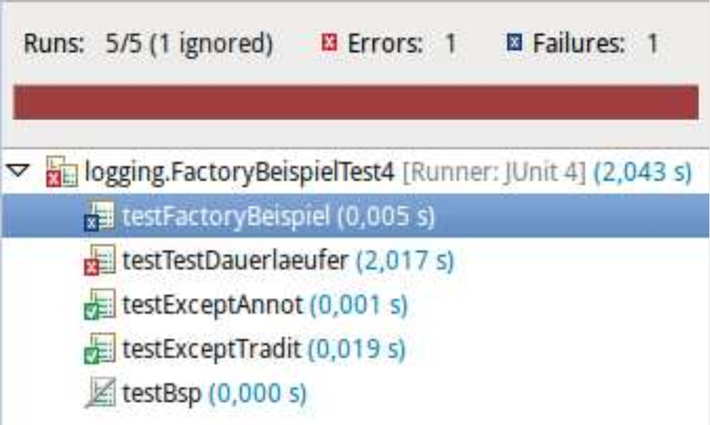

# Testen mit JUnit (JUnit-Basics)

> <details open>
> <summary><strong>🎯 TL;DR</strong></summary>
>
> In JUnit 4 und 5 werden Testmethoden mit Hilfe der Annotation `@Test`
> ausgezeichnet. Über die verschiedenen `assert*()`-Methoden kann das
> Testergebnis mit dem erwarteten Ergebnis verglichen werden und
> entsprechend ist der Test "grün" oder "rot". Mit den verschiedenen
> `assume*()`-Methoden kann dagegen geprüft werden, ob eventuelle
> Vorbedingungen für das Ausführen eines Testfalls erfüllt sind -
> anderenfalls wird der Testfall dann übersprungen.
>
> Mit Hilfe von `@Before` und `@After` können Methoden gekennzeichnet
> werden, die jeweils vor jeder Testmethode und nach jeder Testmethode
> aufgerufen werden. Damit kann man seine Testumgebung auf- und auch
> wieder abbauen (JUnit 4).
>
> Erwartete Exceptions lassen sich in JUnit 4 mit einem Parameter
> `expected` in der Annotation `@Test` automatisch prüfen:
> `@Test(expected=package.Exception.class)`. In JUnit 4 besteht die
> Möglichkeit, Testklassen zu Testsuiten zusammenzufassen und gemeinsam
> laufen zu lassen.
>
> </details>
> <details>
> <summary><strong>🎦 Videos</strong></summary>
>
> - [VL JUnit Basics](https://youtu.be/2SC40rO0ZOE)
> - [Demo assume() vs. assert()](https://youtu.be/j3FK9iTHuDk)
> - [Demo Parametrisierte Tests mit
>   JUnit4](https://youtu.be/KsFydUSBDTc)
> - [Demo Parametrisierte Tests mit
>   JUnit5](https://youtu.be/0H-OCICktS0)
>
> </details>

## JUnit: Ergebnis prüfen

Klasse **`org.junit.Assert`** enthält diverse **statische** Methoden zum
Prüfen:

``` java
// Argument muss true bzw. false sein
void assertTrue(boolean);
void assertFalse(boolean);

// Gleichheit im Sinne von equals()
void assertEquals(Object, Object);

// Test sofort fehlschlagen lassen
void fail();

...
```

## To "assert" or to "assume"?

- Mit `assert*` werden Testergebnisse geprüft
  - Test wird ausgeführt
  - Ergebnis: OK, Failure, Error

<!-- -->

- Mit `assume*` werden Annahmen über den Zustand geprüft
  - Test wird abgebrochen, wenn Annahme nicht erfüllt
  - Prüfen von Vorbedingungen: Ist der Test hier ausführbar/anwendbar?

<p align="right">Beispiel:
junit4.TestAssume (https://github.com/Programmiermethoden-CampusMinden/PM-Lecture/blob/master/markdown/testing/src/junit4/TestAssume.java)</p>

## Setup und Teardown: Testübergreifende Konfiguration

``` java
private Studi x;

@Before
public void setUp() { x = new Studi(); }

@Test
public void testToString() {
    // Studi x = new Studi();
    assertEquals(x.toString(), "Heinz (15cps)");
}
```

**`@Before`**
:   wird **vor jeder** Testmethode aufgerufen

**`@BeforeClass`**
:   wird **einmalig** vor allen Tests aufgerufen (`static`!)

**`@After`**
:   wird **nach jeder** Testmethode aufgerufen

**`@AfterClass`**
:   wird **einmalig** nach allen Tests aufgerufen (`static`!)

In JUnit 5 wurden die Namen dieser Annotationen leicht geändert:

| JUnit 4        | JUnit 5       |
|:---------------|:--------------|
| `@Before`      | `@BeforeEach` |
| `@After`       | `@AfterEach`  |
| `@BeforeClass` | `@BeforeAll`  |
| `@AfterClass`  | `@AfterAll`   |

## Beispiel für den Einsatz von `@Before`

Annahme: **alle/viele** Testmethoden brauchen **neues** Objekt `x` vom
Typ `Studi`

``` java
private Studi x;

@Before
public void setUp() {
    x = new Studi("Heinz", 15);
}

@Test
public void testToString() {
    // Studi x = new Studi("Heinz", 15);
    assertEquals(x.toString(), "Name: Heinz, credits: 15");
}

@Test
public void testGetName() {
    // Studi x = new Studi("Heinz", 15);
    assertEquals(x.getName(), "Heinz");
}
```

## Ignorieren von Tests

- Hinzufügen der Annotation `@Ignore`
- Alternativ mit Kommentar: `@Ignore("Erst im nächsten Release")`

<div class="columns">

<div class="column" width="52%">

``` java
@Ignore("Warum ignoriert")
@Test
public void testBsp() {
    Bsp x = new Bsp();
    assertTrue(x.isTrue());
}
```

</div>

<div class="column" width="48%">

<div style="width:40%;">



</div>

</div>

</div>

In JUnit 5 wird statt der Annotation `@Ignore` die Annotation
`@Disabled` mit der selben Bedeutung verwendet. Auch hier lässt sich als
Parameter ein String mit dem Grund für das Ignorieren des Tests
hinterlegen.

## Vermeidung von Endlosschleifen: Timeout

- Testfälle werden nacheinander ausgeführt
- Test mit Endlosschleife würde restliche Tests blockieren
- Erweitern der `@Test`-Annotation mit Parameter "`timeout`": =\>
  `@Test(timeout=2000)` (Zeitangabe in Millisekunden)

<div class="columns">

<div class="column" width="52%">

``` java
@Test(timeout = 2000)
void testTestDauerlaeufer() {
    while (true) { ; }
}
```

</div>

<div class="column" width="44%">

<div style="width:40%;">


</div>

</div>

</div>

In JUnit 5 hat die Annotation `@Test` keinen `timeout`-Parameter mehr.
Als Alternative bietet sich der Einsatz von
`org.junit.jupiter.api.Assertions.assertTimeout` an. Dabei benötigt man
allerdings *Lambda-Ausdrücke* (Verweis auf spätere VL):

``` java
@Test
void testTestDauerlaeufer() {
    assertTimeout(ofMillis(2000), () -> {
        while (true) { ; }
    });
}
```

(Beispiel von oben mit Hilfe von JUnit 5 formuliert)

## Test von Exceptions: Expected

Traditionelles Testen von Exceptions mit `try` und `catch`:

``` java
@Test
public void testExceptTradit() {
    try {
        int i = 0 / 0;
        fail("keine ArithmeticException ausgeloest");
    } catch (ArithmeticException aex) {
        assertNotNull(aex.getMessage());
    } catch (Exception e) {
        fail("falsche Exception geworfen");
    }
}
```

Der `expected`-Parameter für die `@Test`-Annotation in JUnit 4 macht
dies deutlich einfacher: `@Test(expected = MyException.class)` =\> Test
scheitert, wenn diese Exception **nicht** geworfen wird

``` java
@Test(expected = java.lang.ArithmeticException.class)
public void testExceptAnnot() {
    int i = 0 / 0;
}
```

In JUnit 5 hat die Annotation `@Test` keinen `expected`-Parameter mehr.
Als Alternative bietet sich der Einsatz von
`org.junit.jupiter.api.Assertions.assertThrows` an. Dabei benötigt man
allerdings *Lambda-Ausdrücke* (Verweis auf spätere VL):

``` java
@Test
public void testExceptAnnot() {
    assertThrows(java.lang.ArithmeticException.class, () -> {
        int i = 0 / 0;
    });
}
```

(Beispiel von oben mit Hilfe von JUnit 5 formuliert)

## Parametrisierte Tests

Manchmal möchte man den selben Testfall mehrfach mit anderen Werten
(Parametern) durchführen.

``` java
class Sum {
    public int sum(int i, int j) {
        return i + j;
    }
}

class SumTest {
    @Test
    public void testSum() {
        Sum s = new Sum();
        assertEquals(s.sum(1, 1), 2);
    }
    // und mit (2,2, 4), (2,2, 5), ...????
}
```

Prinzipiell könnte man dafür entweder in einem Testfall eine Schleife
schreiben, die über die verschiedenen Parameter iteriert. In der
Schleife würde dann jeweils der Aufruf der zu testenden Methode und das
gewünschte Assert passieren. Alternativ könnte man den Testfall
entsprechend oft duplizieren mit jeweils den gewünschten Werten.

Beide Vorgehensweisen haben Probleme: Im ersten Fall würde die Schleife
bei einem Fehler oder unerwarteten Ergebnis abbrechen, ohne dass die
restlichen Tests (Werte) noch durchgeführt würden. Im zweiten Fall
bekommt man eine unnötig große Anzahl an Testmethoden, die bis auf die
jeweiligen Werte identisch sind (Code-Duplizierung).

### Parametrisierte Tests mit JUnit 4

JUnit 4 bietet für dieses Problem sogenannte "parametrisierte Tests" an.
Dafür muss eine Testklasse in JUnit 4 folgende Bedingungen erfüllen:

1.  Die Testklasse wird mit der Annotation
    `@RunWith(Parameterized.class)` ausgezeichnet.
2.  Es muss eine öffentliche statische Methode geben mit der Annotation
    `@Parameters`. Diese Methode liefert eine Collection zurück, wobei
    jedes Element dieser Collection ein Array mit den Parametern für
    einen Durchlauf der Testmethoden ist.
3.  Die Parameter müssen gesetzt werden. Dafür gibt es zwei Varianten:
    a)  Für jeden Parameter gibt es ein öffentliches Attribut. Diese
        Attribute müssen mit der Annotation `@Parameter` markiert sein
        und können in den Testmethoden normal genutzt werden. JUnit
        sorgt dafür, dass für jeden Eintrag in der Collection aus der
        statischen `@Parameters`-Methode diese Felder gesetzt werden und
        die Testmethoden aufgerufen werden.
    b)  Alternativ gibt es einen Konstruktor, der diese Werte setzt. Die
        Anzahl der Parameter im Konstruktor muss dabei exakt der Anzahl
        (und Reihenfolge) der Werte in jedem Array in der von der
        statischen `@Parameters`-Methode gelieferten Collection
        entsprechen. Der Konstruktor wird für jeden Parametersatz einmal
        aufgerufen und die Testmethoden einmal durchgeführt.

Letztlich wird damit das Kreuzprodukt aus Testmethoden und Testdaten
durchgeführt.

<p align="right">Beispiel: junit4.SumTestConstructor,
junit4.SumTestParameters (https://github.com/Programmiermethoden-CampusMinden/PM-Lecture/tree/master/markdown/testing/src/junit4/)</p>

### Parametrisierte Tests mit JUnit 5

In JUnit 5 werden parametrisierte Tests mit der Annotation
`@ParameterizedTest` gekennzeichnet (statt mit `@Test`).

Mit Hilfe von `@ValueSource` kann man ein einfaches Array von Werten
(Strings oder primitive Datentypen) angeben, mit denen der Test
ausgeführt wird. Dazu bekommt die Testmethode einen entsprechenden
passenden Parameter:

``` java
@ParameterizedTest
@ValueSource(strings = {"wuppie", "fluppie", "foo"})
void testWuppie(String candidate) {
    assertTrue(candidate.equals("wuppie"));
}
```

Alternativ lassen sich als Parameterquelle u.a. Aufzählungen
(`@EnumSource`) oder Methoden (`@MethodSource`) angeben.

*Hinweis*: Parametrisierte Tests werden in JUnit 5 derzeit noch als
"*experimentell*" angesehen!

<p align="right">Beispiel: junit5.TestValueSource,
junit5.TestMethodSource (https://github.com/Programmiermethoden-CampusMinden/PM-Lecture/tree/master/markdown/testing/src/junit5/)</p>

## Testsuiten: Tests gemeinsam ausführen (JUnit 4)

Eclipse: `New > Other > Java > JUnit > JUnit Test Suite`

``` java
import org.junit.runner.RunWith;
import org.junit.runners.Suite;
import org.junit.runners.Suite.SuiteClasses;

@RunWith(Suite.class)
@SuiteClasses({
    // Hier kommen alle Testklassen rein
    PersonTest.class,
    StudiTest.class
})

public class MyTestSuite {
    // bleibt leer!!!
}
```

## Testsuiten mit JUnit 5

In JUnit 5 gibt es zwei Möglichkeiten, Testsuiten zu erstellen:

- `@SelectPackages`: Angabe der Packages, die für die Testsuite
  zusammengefasst werden sollen
- `@SelectClasses`: Angabe der Klassen, die für die Testsuite
  zusammengefasst werden sollen

``` java
@RunWith(JUnitPlatform.class)
@SelectClasses({StudiTest5.class, WuppieTest5.class})
public class MyTestSuite5 {
    // bleibt leer!!!
}
```

Zusätzlich kann man beispielsweise mit `@IncludeTags` oder
`@ExcludeTags` Testmethoden mit bestimmten Tags einbinden oder
ausschließen. Beispiel: Schließe alle Tests mit Tag "develop" aus:
`@ExcludeTags("develop")`. Dabei wird an den Testmethoden zusätzlich das
Tag `@Tag` verwendet, etwas `@Tag("develop")`.

**Achtung**: Laut der offiziellen Dokumentation [(Abschnitt "4.4.4. Test
Suite")](https://junit.org/junit5/docs/current/user-guide/#running-tests-junit-platform-runner-test-suite)
gilt zumindest bei der Selection über `@SelectPackages` der Zwang zu
einer Namenskonvention: Es werden dabei nur Klassen gefunden, deren Name
mit `Test` beginnt oder endet! Weiterhin werden Testsuites mit der
Annotation `@RunWith(JUnitPlatform.class)` **nicht** auf der "JUnit
5"-Plattform ausgeführt, sondern mit der JUnit 4-Infrastuktur!

## Wrap-Up

JUnit als Framework für (Unit-) Tests; hier JUnit 4 (mit Ausblick auf
JUnit 5)

- Testmethoden mit Annotation `@Test`
- `assert` (Testergebnis) vs. `assume` (Testvorbedingung)
- Aufbau der Testumgebung `@Before`
- Abbau der Testumgebung `@After`
- Steuern von Tests mit `@Ignore` oder `@Test(timout=XXX)`
- Exceptions einfordern mit `@Test(expected=package.Exception.class)`
- Tests zusammenfassen zu Testsuiten

## 📖 Zum Nachlesen

- vogella GmbH ([2021](#ref-vogellaJUnit))
- The JUnit Team ([2022](#ref-junit4))
- Kleuker ([2019](#ref-Kleuker2019))
- Osherove ([2014](#ref-Osherove2014))
- Spillner und Linz ([2012](#ref-Spillner2012))
- Thies, Noelke, und Ungerc ([o. J.](#ref-fernunihagenJunit))

------------------------------------------------------------------------

> [!TIP]
> <details>
> <summary><strong>✅ Lernziele</strong></summary>
>
> - k3: Steuern von Tests (ignorieren, zeitliche Begrenzung)
> - k3: Prüfung von Exceptions
> - k3: Aufbau von Testsuiten mit JUnit
>
> </details>
> <details>
> <summary><strong>🧩 Quizzes</strong></summary>
>
> - [Quiz JUnit-Basics
>   (ILIAS)](https://www.hsbi.de/elearning/goto.php?target=tst_1106545&client_id=FH-Bielefeld)
>
> </details>
> <details>
> <summary><strong>🏅 Challenges</strong></summary>
>
> Schreiben Sie eine JUnit-Testklasse (JUnit 4.x oder 5.x) und testen
> Sie eine `ArrayList<String>`. Prüfen Sie dabei, ob das Einfügen und
> Entfernen wie erwartet funktioniert.
>
> 1.  Initialisieren Sie in einer `setUp()`-Methode das Testobjekt und
>     fügen Sie zwei Elemente ein. Stellen Sie mit einer passenden
>     `assume*`-Methode sicher, dass die Liste genau diese beiden
>     Elemente enthält. Die `setUp()`-Methode soll vor jedem Testfall
>     ausgeführt werden.
>
> 2.  Setzen Sie in einer `tearDown()`-Methode das Testobjekt wieder auf
>     `null` und stellen Sie mit einer passenden `assume*`-Methode
>     sicher, dass das Testobjekt tatsächlich `null` ist. Die
>     `tearDown()`-Methode soll nach jedem Testfall ausgeführt werden.
>
> 3.  Schreiben Sie eine Testmethode `testAdd()`. Fügen Sie ein weiteres
>     Element zum Testobjekt hinzu und prüfen Sie mit einer passenden
>     `assert*`-Methode, ob die Liste nach dem Einfügen den gewünschten
>     Zustand hat: Die Länge der Liste muss 3 Elemente betragen und alle
>     Elemente müssen in der richtigen Reihenfolge in der Liste stehen.
>
> 4.  Schreiben Sie eine Testmethode `testRemoveObject()`. Entfernen Sie
>     ein vorhandenes Element (über die Referenz auf das Objekt) aus dem
>     Testobjekt und prüfen Sie mit einer passenden `assert*`-Methode,
>     ob die Liste nach dem Entfernen den gewünschten Zustand hat: Die
>     Liste darf nur noch das verbleibende Element enthalten.
>
> 5.  Schreiben Sie eine Testmethode `testRemoveIndex()`. Entfernen Sie
>     ein vorhandenes Element über dessen *Index* in der Liste und
>     prüfen Sie mit einer passenden `assert*`-Methode, ob die Liste
>     nach dem Entfernen den gewünschten Zustand hat: Die Liste darf nur
>     noch das verbleibende Element enthalten. (Nutzen Sie zum Entfernen
>     die `remove(int)`-Methode der Liste.)
>
> 6.  Schreiben Sie zusätzlich einen **parametrisierten JUnit-Test** für
>     die folgende Klasse:
>
>     ``` java
>     import java.util.ArrayList;
>
>     public class SpecialArrayList extends ArrayList<String> {
>         public void concatAddStrings(String a, String b) {
>             this.add(a + b);
>         }
>     }
>     ```
>
>     Testen Sie, ob die Methode `concatAddStrings` der Klasse
>     `SpecialArrayList` die beiden übergebenen Strings korrekt
>     konkateniert und das Ergebnis richtig in die Liste einfügt. Testen
>     Sie dabei mit mindestens den folgenden Parameter-Tripeln:
>
>     |   a   |   b   | expected |
>     |:-----:|:-----:|:--------:|
>     |  ""   |  ""   |    ""    |
>     |  ""   |  "a"  |   "a"    |
>     |  "a"  |  ""   |   "a"    |
>     | "abc" | "123" | "abc123" |
>
> </details>

------------------------------------------------------------------------

> [!NOTE]
> <details>
> <summary><strong>👀 Quellen</strong></summary>
>
> <div id="refs" class="references csl-bib-body hanging-indent"
> entry-spacing="0">
>
> <div id="ref-Kleuker2019" class="csl-entry">
>
> Kleuker, S. 2019. *Qualitätssicherung durch Softwaretests*. Springer
> Vieweg. <https://doi.org/10.1007/978-3-658-24886-4>.
>
> </div>
>
> <div id="ref-Osherove2014" class="csl-entry">
>
> Osherove, R. 2014. *The Art of Unit Testing*. Manning.
>
> </div>
>
> <div id="ref-Spillner2012" class="csl-entry">
>
> Spillner, A., und T. Linz. 2012. *Basiswissen Softwaretest*. 5. Aufl.
> dpunkt.
>
> </div>
>
> <div id="ref-junit4" class="csl-entry">
>
> The JUnit Team. 2022. „JUnit 5". 2022. <https://junit.org/>.
>
> </div>
>
> <div id="ref-fernunihagenJunit" class="csl-entry">
>
> Thies, A., C. Noelke, und Ungerc. o. J. „Einführung in JUnit".
> Fernuniversität in Hagen. Zugegriffen 14. April 2020.
> <https://wiki.fernuni-hagen.de/eclipse/index.php/Einführung_in_JUnit>.
>
> </div>
>
> <div id="ref-vogellaJUnit" class="csl-entry">
>
> vogella GmbH. 2021. „JUnit 5 Tutorial - Learn How to Write Unit
> Tests". 2021. <https://www.vogella.com/tutorials/JUnit/article.html>.
>
> </div>
>
> </div>
>
> </details>

------------------------------------------------------------------------

<div style="width:10%;">


</div>

Unless otherwise noted, this work is licensed under CC BY-SA 4.0.

<blockquote><p><sup><sub><strong>Last modified:</strong> 71232c0 (tooling: shift headings (use h1 as top-level headings), 2025-04-29)<br></sub></sup></p></blockquote>
